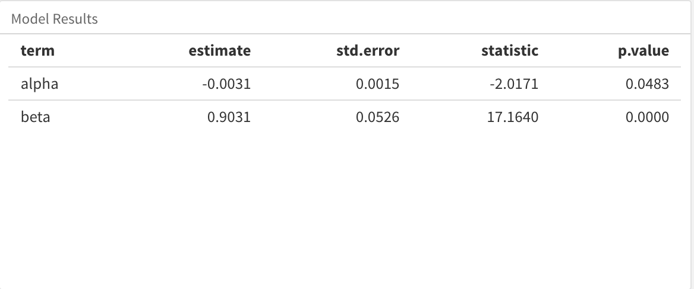

# Portfolio Theory {-}

In this section we will devote four chapters to the relationship between risk and return, or what I think of as a simplified introduction to Modern Portfolio Theory.  As with volatility/risk, we will not delve deep into the theory of these concepts but instead will focus on readable, reproducible workflows using different R objects and packages.

If you wish to delve further into these topics, have a look at BKM and Eric Zivot's new book. Or, go back to the source and fire up Harry Markowitz's 1959 monograph, "Portfolio Selection: Efficient Diversification of Investments"[^1]. Sortino's original paper " and William Sharpe's "".

[^1]: Markowitz, Harry. Portfolio Selection: Efficient Diversification of Investments, John Wiley & Sons, 1959.

Up until now, we have been looking at returns in isolation and risk in isolation, without regard to how the two are related. This section will focus on their relationship, how to measure it, how to think about, how to visualize it. 

First, we will discuss the Sharpe Ratio and the Sortino Ratio, two measures of the return/risk ratio of a portfolio.

Then, we will look at the Capital Asset Pricing Model and specifically how to calculate the market beta for our assets and portfolio. This will be an introduction to simple linear regression as well.

We will conclude with an exploration of the Fama French factor model and an introduction to multiple linear regression.

The world of portfolio theory is vast and far reaching and we are focusing on four small corners of that world, but Sharpe and Sortino are important ratio and CAPM-FF are iconic. We are focusing on the foundational but hopefully it lays the ground work for more complex work in your future.

# Sharpe Ratio

```{r, echo = FALSE}
library(tidyverse)
library(tidyquant)
library(timetk)
library(tibbletime)
library(highcharter)
library(scales)
load('book-data.Rdata')
```


We start out journey into portfolio theory with an investigation of the Sharpe Ratio.

Briefly, the Sharpe Ratio is the mean of the excess portfolio returns above the risk-free rate, divided by the standard deviation of the excess monthly returns above the risk-free rate.  This is the formulation of the Sharpe Ratio as of 1994; if we wished to use the original formulation from 1966 the denominator would be the standard deviation of portfolio monthly returns. Learn more here: web.stanford.edu/~wfsharpe/art/sr/sr.htm.

In other words, the Sharpe Ratio measures excess returns per unit of volatility, where we take the standard deviation to represent portfolio volatility. The Sharpe Ratio was brought to us by Bill Sharpe - arguably the most important economist for modern investment management as the creator of the Sharpe Ratio, CAPM (which we will cover later) and Financial Engines, a forerunner of today's robo-advisor movement.

The Latex code for the Sharpe Ratio equation is as follows

```{r, eval = FALSE}
$$Sharpe~Ratio={(\overline{R_{p}-R_{f}})}/\sigma_{excess}$$
```

And here is the output

$$Sharpe~Ratio={(\overline{R_{p}-R_{f}})}/\sigma_{excess}$$

The numerator is the mean excess return above the risk free rate and the numerator is the standard deviation of those excess returns.  In other words, it's a ratio of return to risk and so a higher Sharpe Ratio indicates a 'better' portfolio.


When working with the Sharpe Ratio, we have two critical choices: how to construct the portfolio using assets and weights, and which risk free to use.  We've already chosen a portfolio and analyzed it's risk and return, so that leaves a risk free rate. Let's go with .03%. If you don't like that one, please substitute and experiment at will! 
    
Let's assign the risk free rate to a variable called `rfr`.

```{r}
rfr <- .0003
```

### Sharpe Ratio in the `xts` world {-}

Calculating the Sharpe Ratio in the `xts` world is almost depressingly convenient. We call `SharpeRatio(portfolio_returns_xts, Rf = rfr)`, passing our portfolio returns and risk-free rate to the built-in function from `PerformanceAnalytics`.

```{r}
sharpe_xts <- 
  SharpeRatio(portfolio_returns_xts_rebalanced_monthly, Rf = rfr) %>% 
  `colnames<-`("ratio")
```

From a substantive perspective, we could stop here and start visualizing with `highcharter`. But we're not going do that! Let's head to the tidyverse. 

### Sharpe Ration in the Tidyverse {-}

For our tidyverse example, let's use a by-hand calculation and implement it via pipes and `dplyr`.

We call start with our object `portfolio_returns_dplyr_byhand` and then invoke `summarise(ratio = mean(returns - rfr)/sd(returns - rfr))`.  


```{r}
sharpe_tidyverse_byhand <- 
  portfolio_returns_dplyr_byhand %>% 
  summarise(ratio = mean(returns - rfr)/sd(returns - rfr))

sharpe_tidyverse_byhand$ratio
```

### Shape Ratio with Tidyquant {-}

Now on to `tidyquant`, which allows us to apply the `SharpeRatio()` function from `PerformanceAnalytics` to a `tibble`. 


```{r}
sharpe_tq <- 
  portfolio_returns_tq_rebalanced_monthly %>%
  tq_performance(Ra = returns,
                 performance_fun = SharpeRatio,
                 Rf = rfr) %>%
  select(2) %>% 
  `colnames<-`("ratio")

```

Let's compare our 3 Sharpe objects. 

```{r}
sharpe_xts[1]
sharpe_tidyverse_byhand$ratio
sharpe_tq$ratio
```

We have consistent results from `xts`, `tidyquant` and our by-hand piped calculation. One issue with the Sharpe Ratio is that it's most useful in comparison to other Sharpe Ratios. Is our portfolio's Sharpe good, great, awful? Let's compare it to the Sharpe Ratio of the S&P500 in the same time period.

```{r}
market_returns_xts <- 
    getSymbols("SPY", 
               src = 'yahoo', 
               from = "2013-01-01", 
               to = "2017-12-31", 
               auto.assign = TRUE, 
               warnings = FALSE) %>% 
    map(~Ad(get(.))) %>% 
    reduce(merge) %>%
    `colnames<-`("SPY") %>% 
    to.monthly(indexAt = "last", OHLC = FALSE)

market_sharpe <- 
  market_returns_xts %>%
  tk_tbl(preserve_index = TRUE, rename_index = "date") %>%
    mutate(returns = (log(SPY) - log(lag(SPY)))) %>% 
    na.omit() %>% 
    summarise(ratio = mean(returns - rfr)/sd(returns - rfr))

market_sharpe$ratio
```

Uh oh, our portfolio has underperfomed the market - all of work for nothing! What might explain this? It's been 5 years of inexorably bullish market behavior and that makes it hard to outperform. 

In any event, let's visualize!. 

### Visualizing Sharpe Ratios {-}

First, we will get a sense for what proportion of our portfolio returns exceeded the risk-free rate.

When we originally calculated Sharpe by-hand in the tidy world, we used `summarise` to create one new cell for our end result. The code was `summarise(ratio = mean(returns - rfr)/sd(returns - rfr)) `.  

Now, we will make two additions to assist in our data visualization. We will add a column for returns that fall below the risk-free rate with `mutate(returns_below_rfr = ifelse(returns < rfr, returns, NA))` and add a column for returns above the risk-free rate with `mutate(returns_above_rfr = ifelse(returns > rfr, returns, NA))`. 

This is not necessary for calculating the Sharpe Ratio, but we will see how it makes our ggplotting a bit easier and it illustrates a benefit of doing things by-hand with `dplyr`: if we want to extract or create certain data tranformations, we can add it to the piped code flow.

```{r}

sharpe_byhand_with_return_columns <- 
  portfolio_returns_tq_rebalanced_monthly %>% 
  mutate(ratio = mean(returns - rfr)/sd(returns - rfr)) %>%  
  mutate(returns_below_rfr = ifelse(returns < rfr, returns, NA)) %>%
  mutate(returns_above_rfr = ifelse(returns > rfr, returns, NA))


```

Let's start with a scatterplot of returns using `ggplot`. 

The goal is to quickly grasp how many of our returns are above the rfr and how many are below the rfr. 

We will create green points for returns above rfr with `geom_point(aes(y = returns_above_rfr), colour = "green")` and red points for returns below rfr with `geom_point(aes(y = returns_below_rfr), colour = "red") `.  

I'm always curious how portfolios have performed since the election so we'll add a blue vertical line at November of 2016.  We will also include a horizontal purple dotted line at the rfr.

```{r, warning = FALSE, message = FALSE}
sharpe_byhand_with_return_columns %>% 
  ggplot(aes(x = date)) +
  geom_point(aes(y = returns_below_rfr), colour = "red") +
  geom_point(aes(y = returns_above_rfr), colour = "green") + 
  geom_vline(xintercept = as.numeric(as.Date("2016-11-30")), color = "blue") +
  geom_hline(yintercept = rfr, color = "purple", linetype = "dotted") +
  annotate(geom = "text", x = as.Date("2016-11-30"), 
           y = -.04, label = "Election", fontface = "plain", 
           angle = 90, alpha = .5, vjust =  1.5) +
  ylab("percent monthly returns") +
  scale_y_continuous(breaks = pretty_breaks(n = 10))
```

Next we will build a histogram of the distribution of returns with `geom_histogram(alpha = 0.25, binwidth = .01, fill = "cornflowerblue")`. We will again add a line for the risk-free rate.

```{r}
sharpe_byhand_with_return_columns %>% 
  ggplot(aes(x = returns)) +
  geom_histogram(alpha = 0.25, binwidth = .01, fill = "cornflowerblue") +
  geom_vline(xintercept = rfr, color = "green") +
  annotate(geom = "text", x = rfr,
    y = 15, label = "rfr", fontface = "plain", angle = 90, alpha = .5, vjust =  1)

```

Interesting to see the distribution of returns in comparison to the risk-free rate, but
we have not visualized the actual Sharpe Ratio yet.  We will do so now.  

The ratio itself is one number. Similar to the standard deviation, skewness and kurtosis of returns, that doesn't allow much by way of dynamic visualization and it might obscure important periods of fluctutation in our data. We can solve that by working with the rolling Sharpe Ratio.

### Rolling Sharpe Ratio in the `xts` World {-}

First, we need to calculate the rolling 6-month Sharpe Ratio with `rollapply(portfolio_returns_xts_rebalanced_monthly, 6, function(x) SharpeRatio(x, Rf = rfr, FUN = "StdDev"))`. 

Note that we need to pass in the argument `FUN = "StdDev"`. Try running the code without that argument check out the error. 

```{r}
window <- 6

rolling_sharpe_xts <- 
  rollapply(portfolio_returns_xts_rebalanced_monthly, window, 
            function(x) SharpeRatio(x, Rf = rfr, FUN = "StdDev")) %>% na.omit() %>% 
  `colnames<-`("sharpe")

```

### Rolling Sharpe Ratio with Tidyverse + Tibbletime {-}

Similar to what we did with the standard deviation, we can combine the tidyverse and tibbletime to run the rolling Sharpe Ratio calculation on our data frame.

Here we are going to write our own function with `rollify()`, but it's the same function we used above to find the Sharpe Ratio, `ratio = mean(returns - rfr)/sd(returns - rfr)`. Notice we still pass in our `rfr` and `window` variables.

```{r}
library(tibbletime)

sharpe_roll_6 <- 
  rollify(function(returns) {
    ratio = mean(returns - rfr)/sd(returns - rfr)
    }, 
window = window)
  
  
rolling_sharpe_tidy_tibbletime <- 
  portfolio_returns_tq_rebalanced_monthly %>%
  as_tbl_time(index = date) %>% 
  mutate(ratio = sharpe_roll_6(returns)) %>% 
  na.omit() %>%
  select(-returns)

```

Let's compare our objects. 

```{r}
head(rolling_sharpe_tidy_tibbletime)
head(rolling_sharpe_xts)
```

### Visualizing the Rolling Sharpe Ratio {-}

Let's start with `highcharter` and investigate any unusual occurrences.

```{r}
highchart(type = "stock") %>%
  hc_title(text = "Rolling Sharpe") %>%
  hc_add_series(rolling_sharpe_xts, name = "sharpe", color = "blue") %>%
  hc_navigator(enabled = FALSE) %>% 
  hc_scrollbar(enabled = FALSE)
```

A huge spike in 2017! Recall that the rolling contribution to volatility of EEM spiked in 2017 as well. There seems to be something afoot during those first six-months.

Let's see how the rolling 12-month compares and whether it smooths out these spikes.

```{r}
sharpe_roll_12_xts <- rollapply(portfolio_returns_xts_rebalanced_monthly, 12, 
                           function(x) SharpeRatio(x, Rf = rfr, FUN = "StdDev"))

highchart(type = "stock") %>%
  hc_title(text = "Rolling sharpe") %>%
  hc_add_series(sharpe_roll_12_xts, name = "sharpe 24", color = "lightgreen") %>%
  hc_navigator(enabled = FALSE) %>% 
  hc_scrollbar(enabled = FALSE)
```

There's still a spike in 2017 but of a smaller magnitude.

If we wish to visualize rolling Sharpe with `ggplot`, we can convert that xts object to a data frame and then pipe on through. 

```{r}
sharpe_roll_12_xts %>% 
  tk_tbl(preserve_index = TRUE, rename_index = "date") %>%
  rename(rolling_sharpe = returns) %>% 
  ggplot(aes(x = date, y = rolling_sharpe)) +
  geom_line(color = "cornflowerblue")
```


Those rolling charts certainly make our portfolio look attractive but remember, it actually had a lower Sharpe Ratio than the S&P500 over this time period! Let's compare their rolling ratios.

```{r}
market_sharpe_roll_12_xts <- rollapply(market_returns_xts, 12, 
                           function(x) SharpeRatio(x, Rf = rfr, FUN = "StdDev"))
  

highchart(type = "stock") %>%
  hc_title(text = "Rolling sharpe") %>%
  hc_add_series(sharpe_roll_12_xts, name = "Portfolio", color = "cornflowerblue") %>%
  hc_add_series(market_sharpe_roll_12_xts, name = "SP500", color = "green") %>%
  hc_navigator(enabled = FALSE) %>% 
  hc_scrollbar(enabled = FALSE)

```

It seems our portfolio underperformed early and outperformed late.  Let's head to Shiny so end users (and ourselves) can build more interesting portfolios and compare to the S&P500.

### Shiny for Sharpe Ratio {-}

On to Shiny and we will stick with our standard template but add a few aesthetics/best practices. 

Have a quick look at the final app here: 

www.reproduciblefinance.com/shiny/sharpe-ratio/

And here is a snapshot

```{r, echo=FALSE, fig.cap = "Sharpe Ratio Shiny App", out.width='100%'}
knitr::include_graphics("snapshots/sharpe-app.png")
```


Notice that we have added two blue value boxes to display the portfolio and market Sharpe Ratios over whatever time period the end user has selected.  Do you like those? Despise them? We'll run through how to build them anyway. 

Additionally, try setting the asset weights to a number that does not equal 100 and see the error message. We will review how to add these below.

But, first, our input sidebar is our standard except the user can choose a risk-free rate. I've chosen to handle that by letting the user enter his or her own number but imagine other methods like the ability to choose a T-bill rate. Or perhaps we feel that the risk-free rate should be set and not changeable because it changes how the end user perceives a portfolio so much.

Here we use `numericInput("rfr", "RFR", .0003, min = 0, max = 1, step = .0002)` to let the user choose a risk-free rate.

```{r, eval = FALSE}
numericInput("rfr", "RFR", .0003, min = 0, max = 1, step = .0002)
```

Now we follow our same flows from above to calculate the rolling Sharpe Ratio. 

First, let's assign our risk-free rate and rolling window objects. We also save the `prices` object as we have done in our previous apps.

```{r, eval = FALSE}
rfr <- eventReactive(input$go, {input$rfr/100})

window <- eventReactive(input$go, {input$window})
```

Note that we ask for a risk-free rate *percent*. Thus, when calculating the reactive, we divide by 100.

Next, we call a reactive to calculate the rolling Sharpe Ratio.

```{r, eval = FALSE}

rolling_portfolio_sharpe_xts <- eventReactive(input$go, {
  
  validate(need(input$w1 + input$w2 + input$w3 + input$w4 + input$w5 == 100, 
                "The portfolio weights must sum to 100%!"))
  
  prices <- prices()
  
  w <- c(input$w1/100, input$w2/100, input$w3/100, input$w4/100, input$w5/100)
  
  rfr <- rfr()
  
  window <- window()

prices_monthly <- to.monthly(prices, indexAt = "last", OHLC = FALSE)
asset_returns_xts <- na.omit(Return.calculate(prices_monthly, method = "log"))

portfolio_returns_xts_rebalanced_monthly <- Return.portfolio(asset_returns_xts, weights = w, rebalance_on = "months")

rolling_sharpe <- 
  rollapply(portfolio_returns_xts_rebalanced_monthly, window, 
                           function(x) SharpeRatio(x, Rf = rfr, FUN = "StdDev"))
})
```

Note one crucial line in the above reactive, `validate(need(input$w1 + input$w2 + input$w3 + input$w4 + input$w5 == 100, "The portfolio weights must sum to 100%!"))`. This is where we ensure that the weights sum to 100. Toggle over to the live app and see what happens when the weights don't sum to 100. 

```{r, echo=FALSE, fig.cap = "Weights Error Message", out.width='100%'}
knitr::include_graphics("snapshots/sharpe-error.png")
```


We haven't included that in any of our previous apps -  because we were introducing new concepts and didn't want to clutter the code - but it's a good idea to include any time the user is choosing weights.

Now let's get the Sharpe Ratio stored in a data frame. We'll use the same object to hold the Sharpe Ratio and returns, same as we did above. This will allow us to use one object in multiple places.
 
```{r, eval = FALSE}
portfolio_sharpe <- eventReactive(input$go, {
  
  validate(need(input$w1 + input$w2 + input$w3 + input$w4 + input$w5 == 100, "The portfolio weights must sum to 100%!"))
  
  prices <- prices()
  w <- c(input$w1/100, input$w2/100, input$w3/100, input$w4/100, input$w5/100)
  
  rfr <- rfr()
  
  portfolio_returns_sharpe <- 
      prices %>% 
      to.monthly(indexAt = "last", OHLC = FALSE) %>% 
      tk_tbl(preserve_index = TRUE, rename_index = "date") %>%
      gather(asset, returns, -date) %>% 
      group_by(asset) %>%  
      mutate(returns = (log(returns) - log(lag(returns)))) %>% 
      tq_portfolio(assets_col = asset, 
               returns_col = returns, 
               weights = w,
               col_rename = "returns") %>% 
      slice(-1) %>%
      mutate(ratio = mean(returns - rfr)/sd(returns - rfr),
         returns_below_rfr = ifelse(returns < rfr, returns, NA),
         returns_above_rfr = ifelse(returns > rfr, returns, NA))

})
```

I like being able to compare to the S&P500 Sharpe, so we'll also calculate and chart that. The  market Sharpe has to be an interactive as well because it still depends on the start date and rolling window chosen by the end user.

Have a look at the code chunk below and notice that we save both the market returns and the overall market Sharpe Ratio by using `mutate()` twice: 

`mutate(returns = (log(SPY) - log(lag(SPY))))`

`mutate(market_sharpe = mean(returns - rfr)/sd(returns - rfr))`. 

We will use the `market_sharpe` column in a `valueBox()` to print the overall market Sharpe Ratio. We will use the `returns` column to calculate the rolling market Sharpe for charting with `Highcharter()`.


```{r, eval = FALSE}
market_returns_sharpe <- eventReactive(input$go, {
  rfr <- rfr()
  
  market_returns_sharpe <- 
    getSymbols("SPY", src = 'yahoo', from = input$date, 
             auto.assign = TRUE, warnings = FALSE) %>% 
    map(~Ad(get(.))) %>% 
    reduce(merge) %>%
    `colnames<-`("SPY") %>% 
    to.monthly(indexAt = "last", OHLC = FALSE) %>% 
    tk_tbl(preserve_index = TRUE, rename_index = "date") %>%
    mutate(returns = (log(SPY) - log(lag(SPY)))) %>% 
    na.omit() %>% 
    mutate(market_sharpe = mean(returns - rfr)/sd(returns - rfr))
  
})
```

Let's see how we include the rolling market Sharpe in our time series. First, have a look at the full code chunk: 

```{r, eval = FALSE}
renderHighchart({
  
  validate(need(input$go != 0, "Please choose your portfolio assets, weights, rfr, rolling window and start date and click submit."))
  
  rfr <- rfr()
  window <- window()
  
  market_returns_xts <- 
    market_returns_sharpe() %>% 
    select(date, returns) %>% 
    tk_xts(date_var = date)
  
  rolling_market_sharpe_xts <- 
    rollapply(market_returns_xts, window(), 
                           function(x) SharpeRatio(x, Rf = rfr, FUN = "StdDev"))
  
  highchart(type = "stock") %>%
  hc_title(text = "Rolling Sharpe") %>%
  hc_add_series(rolling_portfolio_sharpe_xts(), name = "Portfolio", color = "cornflowerblue") %>%
  hc_add_series(rolling_market_sharpe_xts, name = "Market", color = "green") %>%
  hc_navigator(enabled = FALSE) %>% 
  hc_scrollbar(enabled = FALSE) 

})
```

Before calling the `highchart()` function, we transform our tidy, data frame market returns to an `xts` object with
`market_returns_xts <- market_returns_sharpe() %>% select(date, returns) %>% tk_xts(date_var = date)`. 

Then we calculate the rolling ratio with
`rolling_market_sharpe_xts <- rollapply(market_returns_xts, window(), function(x) SharpeRatio(x, Rf = rfr, FUN = "StdDev"))`.

We now have two rolling Sharpe Ratio objects. `rolling_market_sharpe_xts` holds the market rolling ratio and `rolling_portfolio_sharpe_xts()` holds the portfolio rolling ratio that we calculated above. We could have calculated the rolling market numbers upstream with our other calculations, especially if we wanted the rolling numbers available elsewhere. But since there is no reason to do so, it's a good idea to get familiar with another place to house calculations. 

To complete that chunk breakdown, we then pass our two objects to `highchart()` with
`hc_add_series(rolling_portfolio_sharpe_xts(), name = "Portfolio", color = "cornflowerblue")` and 
`hc_add_series(rolling_market_sharpe_xts, name = "Market", color = "green")`.

Our rolling visualizations are complete. Now let's display the overall Sharpe Ratios with two `valueBox()` displays. 

We call the `renderValueBox()` function, isolate the portfolio Sharpe Ratio with 
`portfolio_sharpe <- portfolio_sharpe() %>% summarise(ratio = round(mean(ratio), 4))` and then build with
`valueBox(value = tags$p(portfolio_sharpe, style = "font-size: 70%;"), color = "primary")`. This argument `style = "font-size: 70%;"` is purely to set the font size.

```{r, eval = FALSE}
renderValueBox({
  
  portfolio_sharpe <- portfolio_sharpe() %>% summarise(ratio = round(mean(ratio), 4))
  valueBox(value = tags$p(portfolio_sharpe, style = "font-size: 70%;"), color = "primary")
})
```

Repeat the same for the market ratio. 

```{r, eval = FALSE}
renderValueBox({
  
  market_sharpe <- market_returns_sharpe() %>% summarise(ratio = round(mean(market_sharpe), 4))
  valueBox(value = tags$p(market_sharpe, style = "font-size: 70%;"), color = "primary")
})
```

After this, we add a scatterplot and histogram of returns distributions with the same code flow as has been used with our previous Shiny apps,

That's a wrap for our work on the Sharpe Ratio. In the next Chapter, we will see a slight variation of this idea with the Sortino Ratio, and our work on Sharpe Ratios will come in handy.

# Sortino Ratio

The Sortino Ratio is similar to the Sharpe Ratio except that the riskiness of a portfolio is measured by the deviation of returns *below* a target return, instead of by the standard deviation of all returns.  This stands in contradistinction to the Sharpe Ratio, which measures return/risk by the ratio of the returns above the risk free rate divided by the standard deviation of *all* returns.  By way of history, Harry Markowitz, Nobel laureate and father of MPT whom we mentioned in this section's introduction, noted that downside deviation might be a better measure of risk than the standard deviation of all returns, but its calculation was computationally too expensive[^1] (it was 1959, if he only he'd had R on his laptop).

[^1]: Markowitz, Harry. Portfolio Selection: Efficient Diversification of Investments, John Wiley & Sons, 1959

The Latex code for the Sortino Ratio equation is as follows:   

```{r, eval = FALSE}
$$Sortino~Ratio_{portfolio}=\frac{(\overline{Return_{portfolio}-MAR})}{\sqrt{\sum_{t=1}^n min(R_t-MAR,~0)^2}/n}$$
```

And here is the output
$$Sortino~Ratio_{portfolio}=\frac{(\overline{Return_{portfolio}-MAR})}{\sqrt{\sum_{t=1}^n min(R_t-MAR,~0)^2}/n}$$

The denominator in that equation (called the Downside Deviation, semi-deviation or downside risk) can be thought of as the deviation of the returns that fall below some target rate of return for the portfolio. That target rate is called the Minimum Acceptable Rate, or MAR. The numerator is the mean portfolio return minus the MAR. It can be thought of as excess returns in the same was as the numerator of the Sharpe Ratio, except for Sortino it's in excess of whateve minimum rate our team (or our clients) choose.


Let's assign the MAR of .8% to the variable `MAR`. Note that we are holding this portfolio to a higher standard now than we did in the last chapter.

```{r}

MAR <- .008

```

Just as we reused a lot of our skewness code flow in our kurtosis calculation, we will reuse some Sharpe code flow for the Sortino calculations.

### Calculating Sortino Ratio in the `xts` world {-}

In the `xts` world, very similar to the Sharpe Ratio, `PerformanceAnalytics` makes it quick to calculate Sortino. It's the same code as we used for Sharpe, except we call the function `SortinoRatio()` instead of `SharpeRatio()`, and the argument is `MAR = MAR` instead of `Rf = rfr`.

```{r}
sortino_xts <- 
  SortinoRatio(portfolio_returns_xts_rebalanced_monthly, MAR = MAR) %>% 
  `colnames<-`("ratio")
```

### Calculating Sortino Ratio in the Tidyverse {-}

We'll again head to `dplyr` and run a by-hand calculation with `summarise(ratio = mean(returns - MAR)/sqrt(sum(pmin(returns - MAR, 0)^2)/nrow(.)))`. This should look familiar from the previous chapter, but with a different equation.


```{r}
sortino_byhand <- 
  portfolio_returns_tq_rebalanced_monthly %>% 
  summarise(ratio = mean(returns - MAR)/sqrt(sum(pmin(returns - MAR, 0)^2)/nrow(.)))
```

### Calculating Sortino Ratio in the Tidyquant world {-}

Now on to `tidyquant`, which allows us to apply the `SortinoRatio` function from `PerformanceAnalytics` to a `tibble`. 


```{r}
sortino_tidy <- 
  portfolio_returns_tq_rebalanced_monthly %>%
  tq_performance(Ra = returns, 
                 performance_fun = SortinoRatio, 
                 MAR = MAR,
                 method = "full") %>% 
  `colnames<-`("ratio")
```

Let's compare our 3 Sortino objects. 

```{r}
sortino_xts[1]
sortino_byhand$ratio
sortino_tidy$ratio
```

We have consistent results from `xts`, `tidyquant` and our by-hand piped calculation.
Again, the Sortino Ratio is most informative when compared to other Sortino Ratios. Is our portfolio's Sortino good, great, awful? Let's compare it to the Sortino Ratio of the S&P500 in the same time period.


```{r, include=FALSE}
market_returns_xts <- 
    getSymbols("SPY", src = 'yahoo', from = "2013-01-01", 
             auto.assign = TRUE, warnings = FALSE) %>% 
    map(~Ad(get(.))) %>% 
    reduce(merge) %>%
    `colnames<-`("SPY") %>% 
    to.monthly(indexAt = "last", OHLC = FALSE) 

market_returns_tidy <-
  market_returns_xts %>% 
    tk_tbl(preserve_index = TRUE, rename_index = "date") %>%
    mutate(returns = (log(SPY) - log(lag(SPY)))) %>% 
    na.omit() %>%
    select(date, returns)
```


```{r}
market_returns_sortino <- 
  market_returns_tidy %>% 
  summarise(ratio = mean(returns - MAR)/sqrt(sum(pmin(returns - MAR, 0)^2)/nrow(.)))

market_returns_sortino$ratio
```

Ok, once again, the S&P500 has beat our portfolio! That makes sense given that the S&P500 also had a higher Sharpe Ratio. 

### Visualizing the Sortino Ratio {-}

Let's get a better grasp on what the Sortino Ratio is communicating by building some visualizations.

First, we will get a sense for what proportion of our portfolio returns exceeded the MAR.

Very similar to our work on the Shapre Ratio, we will add a column for returns that fall below MAR with `mutate(returns_below_MAR = ifelse(returns < MAR, returns, NA))` and add a column for returns above MAR with `mutate(returns_above_MAR = ifelse(returns > MAR, returns, NA))`. We do this with an eye towards `ggplot`.

```{r}
sortino_byhand <- 
  portfolio_returns_tq_rebalanced_monthly %>% 
  mutate(ratio = mean(returns - MAR)/sqrt(sum(pmin(returns - MAR, 0)^2)/nrow(.))) %>% 
  mutate(returns_below_MAR = ifelse(returns < MAR, returns, NA)) %>%
  mutate(returns_above_MAR = ifelse(returns > MAR, returns, NA))

```

Let's use that new object and it's new columns to create a scatterplot of returns using `ggplot`. 
to again grasp how many of our returns are above the MAR and how many are below the MAR. 

We will create green points for returns above MAR with `geom_point(aes(y = returns_above_MAR), colour = "green")` and red points for returns below MAR with `geom_point(aes(y = returns_below_MAR), colour = "red") `.  

As we did with the Sharpe Ratio, let's add a blue vertical line at November of 2016.  We will also include a horizontal purple dotted line at the MAR.

```{r, warning = FALSE, message = FALSE}
sortino_byhand %>% 
  ggplot(aes(x = date)) +
  geom_point(aes(y = returns_below_MAR), colour = "red") +
  geom_point(aes(y = returns_above_MAR), colour = "green") + 
  geom_vline(xintercept = as.numeric(as.Date("2016-11-30")), color = "blue") +
  geom_hline(yintercept = MAR, color = "purple", linetype = "dotted") +
  annotate(geom="text", x=as.Date("2016-11-30"), 
           y = -.05, label = "Election", fontface = "plain", 
           angle = 90, alpha = .5, vjust =  1.5) +
  ylab("percent monthly returns")
```


It appears that about half of our returns fall below the MAR. Do we consider that to be a successful portfolio? This is not a rigorous test - what strikes us from the number of red dots and where they fall? Do we notice a trend? A period with consistently below or above MAR returns?

Since the election in 2016, there has been only two monthly returns below the MAR and that will lead to a large Sortino since November. 

Next we will build a histogram of the distribution of returns with `geom_histogram(alpha = 0.25, binwidth = .01, fill = "cornflowerblue")`. We will again add a line for the MAR.

```{r}
sortino_byhand %>% 
  ggplot(aes(x = returns)) +
  geom_histogram(alpha = 0.25, binwidth = .01, fill = "cornflowerblue") +
  geom_vline(xintercept = MAR, color = "green") +
  annotate(geom = "text", x = MAR,
    y = 22, label = "MAR", fontface = "plain", angle = 90, alpha = .5, vjust =  1)

```

The Sortino Ratio is often accompanied by a density plot and we'll build one now. First, we will start simple with `stat_density(geom = "line", size = 1, color = "cornflowerblue")` to create a `ggplot` object called `sortino_density_plot`.

```{r}

sortino_density_plot <- 
  sortino_byhand %>% 
  ggplot(aes(x = returns)) +
  stat_density(geom = "line", size = 1, color = "cornflowerblue") 

sortino_density_plot
```

A slight negative skew is a bit more evident here. It would be nice to shade the area that falls below the MAR.  To do that, let's create an object called `shaded_area` using `ggplot_build(p)$data[[1]] %>% filter(x < MAR)`. That snippet will take our original `ggplot` object and create a new object filtered for x values less than MAR. Then we use `geom_area` to add the shaded area to `sortino_density_plot`.

```{r}

shaded_area_data <- ggplot_build(sortino_density_plot)$data[[1]] %>% 
  filter(x < MAR)

sortino_density_plot_shaded <- sortino_density_plot + 
  geom_area(data = shaded_area_data, aes(x = x, y = y), fill="pink", alpha = 0.5) 

sortino_density_plot_shaded
```


Let's add a vertical line label at the exact MAR and an arrow to tell people where downside volatility resides. Note how we can keep adding layers to the `sortino_density_plot_shaded` object from above, which is one of great features of `ggplot`. It allows experimentation with aesthetics without changing the core plot with each iteration.

```{r}

sortino_density_plot_shaded +
  geom_segment(aes(x = 0, y = 1.5, xend = -.05, yend = 1.5),
  arrow = arrow(length = unit(0.4, "cm")), size = .05) +
  geom_segment(data = shaded_area_data, aes(x = MAR, y = 0, xend = MAR, yend = y), 
               color = "red", linetype = "dotted") +
  annotate(geom = "text", x = MAR, y = 5, label = "MAR = 0.8%", 
           fontface = "plain", angle = 90, alpha = .8, vjust =  -1) +
  annotate(geom = "text", x = -.02, y = .1, label = "Downside", 
           fontface = "plain", alpha = .8, vjust =  -1)
```

As with our scatterplot, we have not been shy about aesthetic layering but one goal here is to explore `ggplot` tools, which gives us license to be overinclusive.  

We have done some good work for visualizing the portfolio's returns and how they are distributed relative to the MAR, and how the MAR separates part of the the returns to downside risk. That gives us some intution about the Sortino Ratio.

### Rolling Sortino Ratio with in the `xts` World

As with Sharpe Ratio, let's get to some rolling Sortinos. There is a slight wrinkle though - remember that we exclude above MAR returns from the denominator. If our rolling window is too small, we might end up with a denominator that includes 1 or 2 or 0 downside deviations. That would accurately reflect that the portfolio has done well in that small window but it might report a misleadingly huge number for the rolling window. The rolling 6 month demonstrates this. 

We calculate the rolling 6-month Sortino with `rollapply(portfolio_returns_xts, window, function(x) SortinoRatio(x))`. 

```{r}
window <- 6

rolling_sortino_xts <- 
  rollapply(portfolio_returns_xts_rebalanced_monthly, window, 
            function(x) SortinoRatio(x, MAR = MAR)) %>% 
  na.omit() %>% 
  `colnames<-`("sortino")


```


### Rolling Sortino Ratio with in tidyverse + tibbletime

Similar to what we did with the standard deviation and Sharpe Ratio, we can combine the tidyverse and tibbletime to run the rolling Sortino Ratio calculation on our data frame.

Again we are going to write our own function to `rollify()`, but it's the same function we used above to find the Sortino Ratio, `ratio = mean(returns - MAR)/sqrt(sum(pmin(returns - MAR, 0)^2)/length(returns))`. 

```{r}

sortino_roll_6 <- rollify(function(returns) {
    ratio = mean(returns - MAR)/sqrt(sum(pmin(returns - MAR, 0)^2)/length(returns))
    }, 
window = 6)
  
  
rolling_sortino_tidy_tibbletime <- 
  portfolio_returns_tq_rebalanced_monthly %>%
  as_tbl_time(index = date) %>% 
  mutate(ratio = sortino_roll_6(returns)) %>% 
  na.omit() %>%
  select(-returns)

```

Let's compare our objects. 

```{r}
head(rolling_sortino_tidy_tibbletime)
head(rolling_sortino_xts)
```

The results are consistent and we can start charting.

### Visualizing the Sortino Ratio {-}

Let's start with `highcharter` and pass in our `rolling_sortino_xts`

```{r}
highchart(type = "stock") %>%
  hc_title(text = "Rolling Sortino") %>%
  hc_add_series(rolling_sortino_xts, name = "Sortino", color = "cornflowerblue") %>%
  hc_navigator(enabled = FALSE) %>% 
  hc_scrollbar(enabled = FALSE)
```

The rolling 6-month has so many bizarre spikes. It nicely emphasizes how we need to be careful with the Sortino Ratio, short time periods and rolling applications.

Let's see how the rolling 24-month compares.

```{r}

portfolio_sortino_roll_24_xts <- rollapply(portfolio_returns_xts_rebalanced_monthly, 24, 
                           function(x) SortinoRatio(x, MAR = MAR))

highchart(type = "stock") %>%
  hc_title(text = "Rolling Sortino") %>%
  hc_add_series(portfolio_sortino_roll_24_xts, name = "Sortino 24", color = "lightgreen") %>%
  hc_navigator(enabled = FALSE) %>% 
  hc_scrollbar(enabled = FALSE)
```

Ah, much better. We can see the movements and how the Sortino has changed through the life of this portfolio, but within a reasonable range of .6 to -0.4.

Let's compare to the rolling S&P500 Sortino. 

```{r}
market_sortino_roll_24_xts <- rollapply(market_returns_xts, 24, 
                           function(x) SortinoRatio(x, MAR = MAR))
  

highchart(type = "stock") %>%
  hc_title(text = "Rolling sharpe") %>%
  hc_add_series(portfolio_sortino_roll_24_xts, name = "Portfolio", color = "cornflowerblue") %>%
  hc_add_series(market_sortino_roll_24_xts, name = "SP500", color = "green") %>%
  hc_navigator(enabled = FALSE) %>% 
  hc_scrollbar(enabled = FALSE)

```

I am not going to port these rolling Sortinos to `ggplot` and the tidyverse, but it would follow the exact same code flow as we use for the Sharpe Ratio. Give it a shot! 

Rolling Sortinos need to be handled with care but there are a few nice payoffs. First, these charts force us and our end users to reflect on how time periods can affect Sortino to extremes. Be skeptical if someone reports a fantastic 6-month Sortino. Second, as an exploratory device, the rolling ratios highligh time periods deserving of more investigation.  Third, with Sortino (and Sharpe) Ratios, there's a temptation to look at the final number for a portfolio's life and judge it 'good' or 'bad'. These rolling visualizations can help reframe the analysis and look at how the portfolio behaved in different economic and market regimes.


### Shiny Sortino Ratio {-}

Let's wrap this up into a Shiny app and notice how similar it is to the Sharpe Ratio app in structure. 

Here is the link and snapshot:

www.reproduciblefinance.com/shiny/sortino-ratio/

```{r, echo=FALSE, fig.cap = "Sortino Ratio Shiny App", out.width='100%'}
knitr::include_graphics("snapshots/sortino-app.png")
```

We just saw how the calculations are different from Sharpe to Shiny, but from a Shiny input perspective, the only difference is that the end user chooses a MAR instead of a risk-free rate.


```{r, eval = FALSE}

fluidRow(
  column(5,
  numericInput("mar", "MAR%", .8, min = 0, max = 3, step = .01)),
  column(5,
  numericInput("window", "Window", 6, min = 2, max = 24, step = 2))
)
```

Note that we ask for a MAR *percent*. Thus, when calculating the reactive, we divide by 100. 

```{r, eval = FALSE}
mar <- eventReactive(input$go, {input$mar/100})
```

Why do that? No substantive reason - perhaps it's more intuitive to the user and it keeps the input box from getting too wide.

On that same theme, I removed the value boxes so the user doesn't get to see the overall Sortino Ratio for the portfolio and the market. Why? 

Going back to the idea of experimentation, I would be curious to see if users preferred the value boxes in the Sharpe Ratio app or the cleaner Sortino Ratio. Beyond preference, would they get a different signal? Perhaps end users would be drawn to those value boxes, for better or worse, and ignore the rolling visualizations.  

From there, the app is virtually identical to the Sharpe Ratio app except that I included a density chart, which I think suits a Sortino Ratio. 

The code for that is similar to how we have created other density charts with the addition of a line at the MAR.

```{r, eval = FALSE}
renderPlot({
  validate(need(input$go != 0, "Please choose your portfolio assets, weights, MAR, rolling window and start date and click submit."))
  MAR <- mar()
  portfolio_returns_tq_rebalanced_monthly <- portfolio_returns_tq_rebalanced_monthly()
  
  sortino_density_plot <- portfolio_returns_tq_rebalanced_monthly %>% 
    ggplot(aes(x = returns)) +
    stat_density(geom = "line", size = 1, color = "cornflowerblue") 
  
  shaded_area_data <- ggplot_build(sortino_density_plot)$data[[1]] %>% 
    filter(x < MAR)

  sortino_density_plot + 
  geom_area(data = shaded_area_data, aes(x = x, y = y), fill="pink", alpha = 0.5) +
  geom_segment(data = shaded_area_data, aes(x = MAR, y = 0, xend = MAR, yend = y), 
               color = "red", linetype = "dotted") +
  annotate(geom = "text", x = MAR, y = 5, label = paste("MAR =", MAR, sep = ""), 
           fontface = "plain", angle = 90, alpha = .8, vjust =  -1) +
  annotate(geom = "text", x = (MAR - .02), y = .1, label = "Downside", 
           fontface = "plain", alpha = .8, vjust =  -1)
           
})

```

That's all for our Sortino app. The building of this app was greatly aided by our previous work on visualizing returns and building a Sharpe Ratio app. We can move faster as we build on the past. 

Next we will change gears a bit and look at CAPM and beta.

# CAPM and Beta {-}

By way of extraordinarily brief background, the Capital Asset Pricing Model (CAPM) is a model, created by William Sharpe, that estimates the return of an asset based on the return of the market and the asset's linear relationship to the return of the market. That linear relationship is the stock's beta coefficient, or just good'ol beta. 

CAPM was introduced back in 1964, garnered a Nobel for its creator and, like many ephocally important theories, has been widely used, updated, criticized, debunked, revived, re-debunked, etc. Fama and French have written that CAPM "is the centerpiece of MBA investment courses. Indeed, it is often the only asset pricing model taught in these courses...[u]nfortunately, the empirical record of the model is poor."[^1]  

[^1]: The Capital Asset Pricing Model: Theory and Evidence
Eugene F. Fama and Kenneth R. French, The Capital Asset Pricing Model: Theory and Evidence, The Journal of Economic Perspectives, Vol. 18, No. 3 (Summer, 2004), pp. 25-46

With that, we will forge ahead with our analysis because calculating CAPM betas can serve as a nice template for more complex models in a team's work and sometimes it's a good idea to start with a simple model, even if it hasn't stood up to empirical rigor. Plus, it might have been discredited, but it's still an iconic model that we should learn and love! 

We are going to focus on one particular aspect of CAPM: beta.  Beta, as we noted above, is the beta coefficient of an asset that results from regressing the returns of that asset on market returns.  It captures the linear relationsip between the asset/portfolio and the market. For our purposes, it's a good vehicle for exploring a reproducible flow for modeling or regressing our portfolio returns on the market returns. Even if your team dislikes CAPM in favor of more nuanced models, this workflow can serve as a good base for the building of those more complex models.

Let's get to it. 

### CAPM and Market Returns {-}

Our first step is to make a choice about which asset to use as a proxy for the market return and we will go with the SPY ETF, effectively treating the S&P500 as the market. That's going to make our calculations substantively uninteresting because (1) SPY is 25% of our portfolio and (2) we have chosen assets and a time period (2013 - 2017) in which correlations with SPY have been high. It will offer one benefit in the way of a sanity check, which I'll note below.  With those caveats in mind, feel free to choose a different asset for the market return and try to reproduce this work, or construct a different portfolio that does not include SPY.  

Let's calculate our market return for SPY and save it as `market_return_xts`.

```{r}

market_returns_xts <- 
    getSymbols("SPY", 
               src = 'yahoo', 
               from = "2013-01-01", 
               to = "2017-12-31",
             auto.assign = TRUE, 
             warnings = FALSE) %>% 
    map(~Ad(get(.))) %>% 
    reduce(merge) %>%
    `colnames<-`("SPY") %>% 
    to.monthly(indexAt = "last", OHLC = FALSE)
```

We will also want a data frame object of market returns.

```{r}

market_returns_tidy <-
  market_returns_xts %>% 
    tk_tbl(preserve_index = TRUE, rename_index = "date") %>%
    mutate(returns = (log(SPY) - log(lag(SPY)))) %>% 
    na.omit() %>%
    select(date, returns)

head(market_returns_tidy)

```
We have a `market_return` object. Let's make sure it's periodicity aligns perfectly with our portfolio returns periodicity

```{r}
portfolio_returns_tq_rebalanced_monthly %>% 
  mutate(market_returns = market_returns_tidy$returns) %>%
  head()
```

Note that if the periodicities did not align, `mutate()` would have thrown an error in the code chunk above.

### Calculating CAPM Beta {-}

There are several paths via R code to calculate portfolio beta but first let's have a look at the equation.

```{r, eval = FALSE}
$${\beta}_{portfolio} = cov(R_p, R_m)/\sigma_m $$
```


$${\beta}_{portfolio} = cov(R_p, R_m)/\sigma_m $$

Portfolio beta is equal to the covariance of the portfolio returns and market returns, divided by the variance of market returns.

We can calculate the numerator, or covariance of portfolio and market returns, with `cov(portfolio_returns_xts_rebalanced_monthly, market_returns_tidy$returns)` and the denominator with
`var(market_return$returns)`. 

Our portfolio beta is equal to:

```{r}
cov(portfolio_returns_xts_rebalanced_monthly,market_returns_tidy$returns)/var(market_returns_tidy$returns)
```

That beta is quite near to 1 as we were expecting - afterall, SPY is a big part of this portfolio. 

We can also calculate portfolio beta by finding the beta of each of our assets and then multiplying by asset weights. That is, another equation for portfolio beta is the weighted sum of the asset betas:

```{r, eval = FALSE}
$${\beta}_{portfolio} ={\sum_{i=1}^n}W _i~{\beta}_i $$
```


$${\beta}_{portfolio} ={\sum_{i=1}^n}W _i~{\beta}_i $$

To use that method with R, we first find the beta for each of our assets and this gives us an opportunity to introduce a code flow for running regression analysis.  

We need to regress each of our individual asset returns on the market return.  We could do that for asset 1 with `lm(asset_return_1 ~ market_returns_tidy$returns)`, and then again for asset 2 with `lm(asset_return_2 ~ market_returns_tidy$returns)` etc for all 5 of our assets.  But if we had a 50 asset portfolio, that would be impractical. Instead let's write a code flow and use `map()` to regress all of our assets and calculate betas with one call. 

We will start with our `asset_returns_long` tidy data frame and will then run `nest(-asset)`.

```{r}
beta_assets <- 
  asset_returns_long %>% 
  nest(-asset)

beta_assets
```

That `nest(-asset)` changed our data frame so that there are two columns: one called `asset` that holds our asset name and one called `data` that holds a list of returns for each asset. We have now 'nested' a list of returns within a column.

Now we can use `map()` to apply a function to each of those nested lists and store the results in a new column. `mutate()` is how we create a new column. The whole piped command is
`mutate(model = map(data, ~ lm(returns ~ market_returns_tidy$returns, data = .))) `

```{r}
beta_assets <- 
  asset_returns_long %>% 
  nest(-asset) %>% 
  mutate(model = map(data, ~ lm(returns ~ market_returns_tidy$returns, data = .))) 

beta_assets
```

We now have 3 columns: `asset` which we had before, `data` which we had before, and `model` which we just added. The `model` column holds the results of the regression `lm(returns ~ market_returns_tidy$returns, data = .)` that we ran for each of our assets. Those results are a beta and an intercept for each of our assets  but not in a great format for presenation to others or even readability by ourselves. 

Let's tidy up our results with the `tidy()` function from the `broom` package. We want to apply that function to our model column and will use the `mutate()` and `map()` combination again. The complete call is to
`mutate(model = map(model, tidy))`.


```{r}
beta_assets <- 
  asset_returns_long %>% 
  nest(-asset) %>% 
  mutate(model = map(data, ~ lm(returns ~ market_returns_tidy$returns, data = .))) %>%
  mutate(model = map(model, tidy))

beta_assets
```

We are getting close now but the model `column` holds nested data frames. Have a look and see that they are nicely formatted data frames: 

```{r}
beta_assets$model
```

Still, I don't like to end up with nested data frames, so let's `unnest()` that `model` column.

```{r}
beta_assets <- 
  asset_returns_long %>% 
  nest(-asset) %>% 
  mutate(model = map(data, ~ lm(returns ~ market_returns_tidy$returns, data = .))) %>%
  mutate(model = map(model, tidy)) %>% 
  unnest(model)

beta_assets
```

Now that looks human readable and presentable. We will do one further cleanup and get rid of the intercept results since we are isolating the betas. 

```{r}
beta_assets <- 
  asset_returns_long %>% 
  nest(-asset) %>% 
  mutate(model = map(data, ~ lm(returns ~ market_returns_tidy$returns, data = .))) %>% 
  unnest(model %>% map(tidy)) %>% 
  filter(term == "market_returns_tidy$returns") %>% 
  select(-term)

beta_assets
```

A quick sanity check on those asset betas should reveal that SPY has beta of 1 with itself. 

```{r}
beta_assets %>% select(asset, estimate) %>% filter(asset == "SPY")
```

Now let's see how our combination of these assets leads to a portfolio beta.

We already have our portfolio weights stored as `w_1`, `w_2`, through to `w_5`. We multiply them by the respective beta estimates.

```{r}
beta_byhand <- 
  w_1 * beta_assets$estimate[1] + 
  w_2 * beta_assets$estimate[2] + 
  w_3 * beta_assets$estimate[3] +
  w_4 * beta_assets$estimate[4] +
  w_5 * beta_assets$estimate[5]

beta_byhand
```

That beta is the same as we calculated above using the covariance/variance method, and now we know the the covariance of portfolio returns and market returns divided by the variance of market returns is equal to the weighted estimates we got by regressing each asset's return on market returns. 

### Calculating CAPM Beta in the `xts` World {-}

We can make things even more efficient, of course, with built-in functios. Let's go to the `xts` world and use the built-in `CAPM.beta()` function from `PerformanceAnalytics`. That function takes two arguments: the returns for the portfolio (or any asset) whose beta we wish to calculate, and the market returns. Our function will look like `CAPM.beta(portfolio_returns_xts_rebalanced_monthly, mkt_return_xts)`.


```{r}

beta_builtin_xts <- CAPM.beta(portfolio_returns_xts_rebalanced_monthly, market_returns_xts)

beta_builtin_xts
```

### Calculating CAPM Beta in the Tidyverse {-}

We will run that same function through a `dplyr` and tidyquant code flow to stay in the tidy world.

First we'll use dplyr to grab our portfolio beta. We'll return to this flow later for some visualization but for now will extract the portfolio beta. 

To calculate the beta, we call 
`do(model = lm(returns ~ market_returns_tidy$returns, data = .))`. Then we head back to the `broom` package and use the `tidy()` function to make our model results a little easier on the eyes.

```{r}

beta_dplyr_byhand <-
  portfolio_returns_tq_rebalanced_monthly %>% 
  do(model = lm(returns ~ market_returns_tidy$returns, data = .)) %>% 
  tidy(model) %>% 
  mutate(term = c("alpha", "beta"))

beta_dplyr_byhand
```

### Calculating CAPM Beta in the Tidyquant World {-}

Let's use one more flow woth built-in functions, this time using `tidyquant` and the `tq_performance()` function. This will allow us to apply the `CAPM.beta()` function from `PerformanceAnalytics` to a data frame.

```{r}
beta_builtin_tq <- 
  portfolio_returns_tq_rebalanced_monthly %>% 
  mutate(market_return = market_returns_tidy$returns) %>% 
  na.omit() %>% 
  tq_performance(Ra = returns, 
                 Rb = market_return, 
                 performance_fun = CAPM.beta) %>% 
  `colnames<-`("beta_tq")
```
 
Let's take a quick look at our four beta calculations. 
 
```{r}
beta_byhand
beta_builtin_xts
beta_dplyr_byhand$estimate[2]
beta_builtin_tq$beta_tq
```

Consistent results and a beta near 1 as we were expecting, since our portfolio has a 25% allocation to the S&P500.  We're less concernced with number and more so with the various code flows used to get here. 
### Visualizing the Relationship between Portfolio Returns and Market Returns {-}

Now on to visualization. Since we have introduced a bit of linear modeling, let's return to that `dplyr` by-hand method and visualize the relationshiop between our portfolio and the market returns.  

A good way to start is a scatterplot with market returns on the x-axis and portfolio returns on the y-axis. 

```{r}
portfolio_returns_tq_rebalanced_monthly %>% 
  mutate(market_returns = market_returns_tidy$returns) %>% 
  ggplot(aes(x = market_returns, y = returns)) + 
  geom_point(color = "cornflowerblue") +
  ylab("portfolio returns") +
  xlab("market returns")
```

Our beta calculation is communicating a strong linear relationship, and this scatterplot is communicating the same. We can add a simple regression line to it with `geom_smooth(method = "lm", se = FALSE, color = "green")`.  

```{r}
portfolio_returns_tq_rebalanced_monthly %>% 
  mutate(market_returns = market_returns_tidy$returns) %>% 
  ggplot(aes(x = market_returns, y = returns)) + 
  geom_point(color = "cornflowerblue") +
  geom_smooth(method = "lm", se = FALSE, color = "green") +
  ylab("portfolio returns") +
  xlab("market returns")
```

That green line was produced by the call to `geom_smooth(method = 'lm')`. Under the hood, `ggplot` fit a linear model of the relationship between market returns and portfolio returns. The slope of that green line is the CAPM beta that we calculated earlier.  To confirm that, we can add a line to the scatter that has a slope equal to our beta calculation and a y-intercept equal to what I labeled as alpha in the `beta_dplyr_byhand` object. 

To add the line, we invoke `geom_abline(aes(intercept = beta_dplyr_byhand$estimate[1], slope = beta_dplyr_byhand$estimate[2])`.

```{r}
portfolio_returns_tq_rebalanced_monthly %>% 
  mutate(market_returns = market_returns_tidy$returns) %>% 
  ggplot(aes(x = market_returns, y = returns)) + 
  geom_point(color = "cornflowerblue") +
  geom_abline(aes(intercept = beta_dplyr_byhand$estimate[1], 
                  slope = beta_dplyr_byhand$estimate[2]), 
              color = "purple") +
  ylab("portfolio returns") +
  xlab("market returns")
```


We can plot both lines simultaneously to confirm to ourselves that they are the same - they should be right on top of each other but the purple line, our manual `abline`, extends into infinity so we should see it start where the green line ends.

```{r}
portfolio_returns_tq_rebalanced_monthly %>% 
  mutate(market_returns = market_returns_tidy$returns) %>% 
  ggplot(aes(x = market_returns, y = returns)) + 
  geom_point(color = "cornflowerblue") +
  geom_abline(aes(intercept = beta_dplyr_byhand$estimate[1], 
                  slope = beta_dplyr_byhand$estimate[2]), 
              color = "purple") +
  geom_smooth(method = "lm", se = FALSE, color = "green") +
  ylab("portfolio returns") +
  xlab("market returns")
```


Alright, that seems to confirm that the fitted line calculated by `ggplot` and `geom_smooth()` has a slope equal to the beta we calculated ourselves.

### A Bit More on Linear Regression: Augmenting Our Data {-}

Before concluding our analysis of CAPM beta, let's explore the `augment()` function from `broom` as it's a useful part of the tidy modelling toolkit. 

The code chunk below will start with model results from `lm(returns ~ market_returns_tidy$returns...)` and then the `augment()` function will add predicted values to the original data set. Those predicted values will be in the `.fitted` column. 

```{r}
portfolio_model_augmented <- 
portfolio_returns_tq_rebalanced_monthly %>% 
  do(model = lm(returns ~ market_returns_tidy$returns, data = .)) %>% 
  augment(model)

head(portfolio_model_augmented)
```

Let's use `ggplot()` to see how well the fitted return values match the actual return values. 

```{r}
portfolio_model_augmented %>% 
  ggplot(aes(x = portfolio_returns_tq_rebalanced_monthly$date)) + 
  geom_line(aes(y = returns), color = "cornflowerblue") + 
  geom_line(aes(y = .fitted), color = "green") +
  xlab("date")
```


Those are monthly returns and the fitted values seem to track well. Let's convert both actual returns and fitted returns to the growth of a dollar and run the same comparison. 

```{r}
portfolio_model_augmented %>%
  mutate(actual_growth = cumprod(1 + returns), 
         fitted_growth = cumprod(1 + .fitted)) %>% 
  ggplot(aes(x = portfolio_returns_tq_rebalanced_monthly$date)) + 
  geom_line(aes(y = actual_growth), color = "cornflowerblue") + 
  geom_line(aes(y = fitted_growth), color = "green") +
  xlab("date") +
  ylab("actual and fitted growth") +
  scale_x_date(breaks = pretty_breaks(n= 8)) +
  scale_y_continuous(labels = dollar)

```

Our fitted growth looks pretty good, which again is unsurprising since we regressed on SPY, a big component of our portfolio. 

### CAPM Beta Shiny App {-}

Let's port this work over to Shiny so the user can build a portfolio and calculate its beta, along with plotting portfolio returns against market returns.

Have a look at the final app. Note that the visualizations are different than what we have built previously, but the inputs are the same. 

www.reproduciblefinance.com/shiny/capm-beta/

```{r, echo=FALSE, fig.cap = "CAPM Shiny App", out.width='100%'}
knitr::include_graphics("snapshots/capm-app.png")
```


We are showing the portfolio returns scattered against the market, and with the regression line drawn. We also display the estimates of the alpha and beta terms, along with the p-values.

Our input sidebar is the usual inputs for assets, weights and start date. 

Then we calculate the market return. 

```{r, eval = FALSE}
market_return <- eventReactive(input$go, {
  market_return <- 
    getSymbols("SPY", src = 'yahoo', from = input$date, 
             auto.assign = TRUE, warnings = FALSE) %>% 
    map(~Ad(get(.))) %>% 
    reduce(merge) %>%
    `colnames<-`("SPY") %>% 
    to.monthly(indexAt = "last", OHLC = FALSE) %>% 
    tk_tbl(preserve_index = TRUE, rename_index = "date") %>%
    mutate(returns = (log(SPY) - log(lag(SPY)))) %>% 
    na.omit() %>%
    select(date, returns)
  
})
```

Next we calculate portfolio returns. 

```{r, eval = FALSE}
portfolio_returns_tq_rebalanced_monthly <- eventReactive(input$go, {
  
  prices <- prices()
  w <- c(input$w1/100, input$w2/100, input$w3/100, input$w4/100, input$w5/100)
  
  portfolio_returns_tq_rebalanced_monthly <- 
      prices %>% 
      to.monthly(indexAt = "last", OHLC = FALSE) %>% 
      tk_tbl(preserve_index = TRUE, rename_index = "date") %>%
      gather(asset, returns, -date) %>% 
      group_by(asset) %>%  
      mutate(returns = (log(returns) - log(lag(returns)))) %>% 
      na.omit() %>%
      tq_portfolio(assets_col  = asset, 
               returns_col = returns,
               weights     = w,
               col_rename  = "returns",
               rebalance_on = "months")
})
```


We use those two reactives, `portfolio_returns_tq_rebalanced_monthly` and `market_return` to run our regression and calculate beta.

```{r, eval = FALSE}
beta_dplyr_byhand <- eventReactive(input$go, {
  
  portfolio_returns_tq_rebalanced_monthly <- portfolio_returns_tq_rebalanced_monthly()
  
  market_return <- market_return()
  
  beta_dplyr_byhand <- 
  portfolio_returns_tq_rebalanced_monthly %>% 
  do(model = lm(returns ~ market_return$returns, data = .)) %>% 
  tidy(model) %>% 
  mutate(term = c("alpha", "beta"))
  
})
```

Now we call to `ggplot()` just as we did in our original calculation. 

```{r, eval = FALSE}
renderPlot({
  portfolio_returns_tq_rebalanced_monthly <- portfolio_returns_tq_rebalanced_monthly()
  market_return <- market_return()
  
  portfolio_returns_tq_rebalanced_monthly %>% 
  mutate(market_returns = market_return$returns) %>% 
  ggplot(aes(x = market_returns, y = returns)) + 
  geom_point(color = "cornflowerblue") +
  geom_smooth(method = "lm", se = FALSE, color = "green") +
  ylab("portfolio returns") +
  xlab("market returns")
})
```

We will add one new feature by calling `renderTable()` so we can display the results of our model.
This is not really a data visualization since we are displaying model results but the aesthetics still matter. 

```{r, eval = FALSE}
renderTable({
  beta_dplyr_byhand()
}, digits = 4)
```

```{r, echo=FALSE, fig.cap = "CAPM Model Results", out.width='100%'}

```

Nothing fancy there but it's a clean way to present model results.

### Conclusion on CAPM Beta {-}

That wraps up our section on CAPM beta and simple linear regression. Now on to Fama French and multiple linear regression, plus a deep plunge into a datat import and wrangling challenge.
