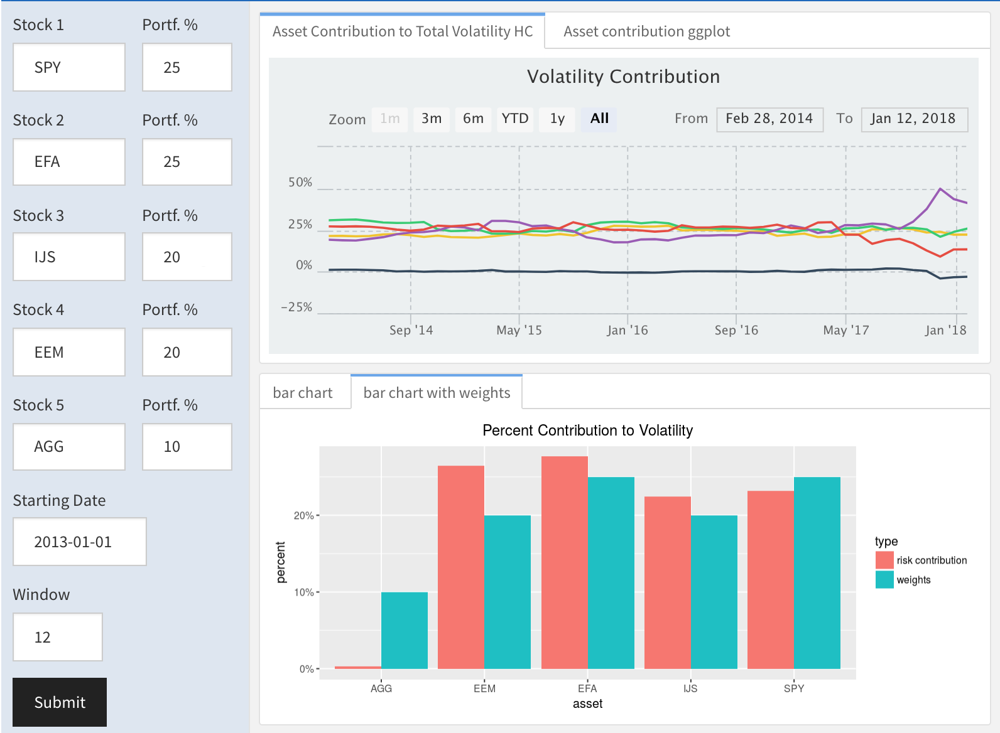
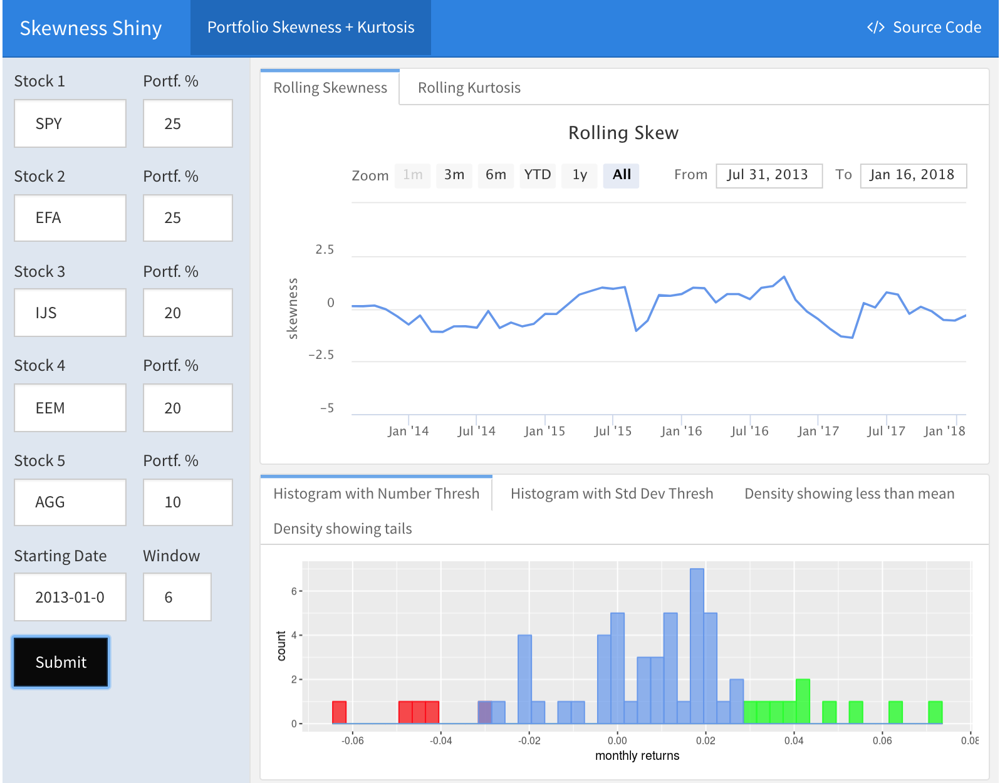
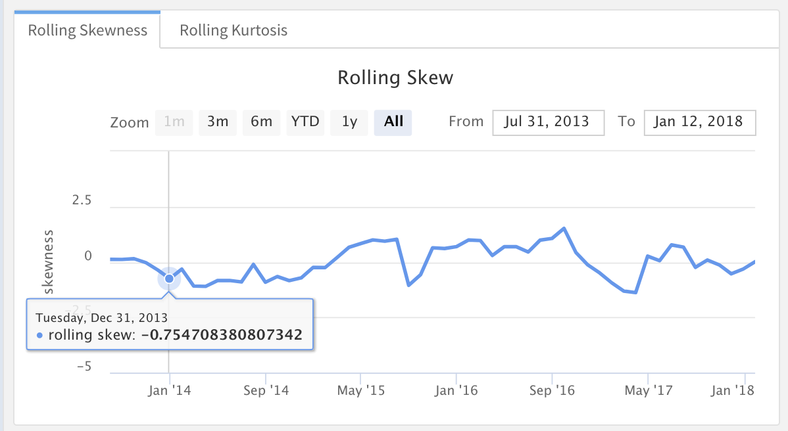
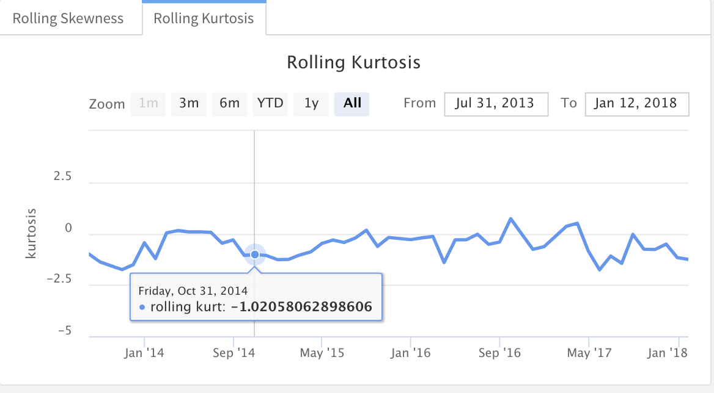
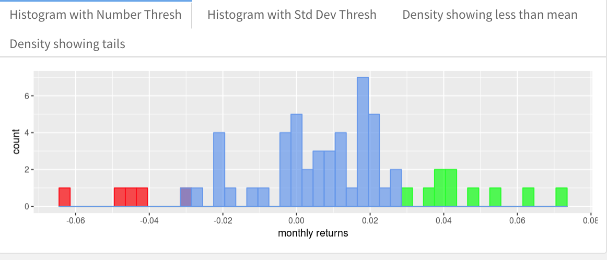
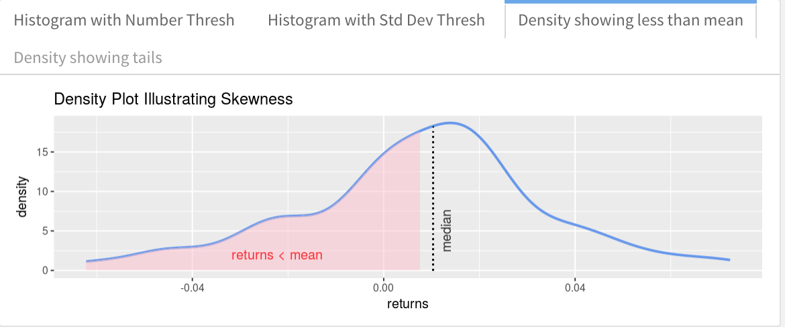
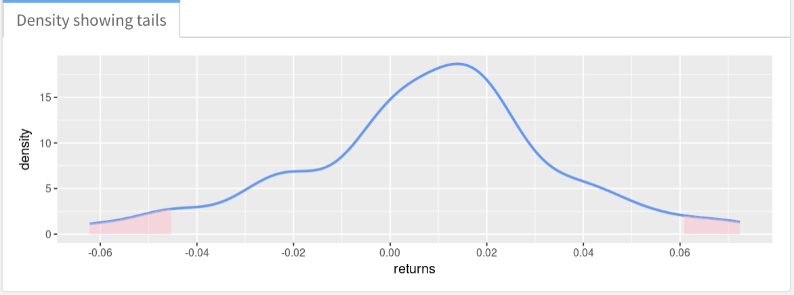

# Risk {-}

Welcome to our chapter focused on portfolio volatility, variance and standard deviation. I realize that it's a lot more fun to ~~fantasize about~~ analyze stock returns which is why television shows and websites constantly update the daily market returns and give them snazzy green and red colors. But good ol'volatility is quite important in its own right, especially to finance geeks, aspiring finance geeks and institutional investors. If you are, might become, or might ever work with/for any of those, this chapter should at least serve as a jumping off point.

By way of brief introduction, we will focus on calculating the standard deviation of our portfolio returns. The reason for this is that standard deviation is taken as a measure of the riskiness of a portfolio. To learn more about why, head back to 1959 and read Markowitz's monograph *Portfolio Selection: Efficient Diversification of Investments*. We will use the words 'standard deviation', 'volatility' and 'risk' interchangeably, but from an analytical perspective, we are thinking about standard deviation. 

# Portfolio Standard Deviation

Let's start with the textbook equation for the standard deviation of a multi-asset portfolio. 

Here is the Latex code for the equation.

```{r, eval = FALSE}
$$Standard~Deviation=\sqrt{\sum_{t=1}^n (x_i-\overline{x})^2/n}$$
```

And here is the output

$$Standard~Deviation=\sqrt{\sum_{t=1}^n (x_i-\overline{x})^2/n}$$
where x is each monthly portfolio return and x-bar is the mean monthly portfolio return. For a multi-asset portfolio, the equation is not simply the weighted variances of each asset. Instead, it's the weight squared of each asset multiplied by that asset's variance, plus the covariance of each asset times the weights of those assets. 

Here is the Latex code for the equation

```{r, eval = FALSE}
$$Standard~Deviation=$$
$$w_{asset1}^{2} * var_{asset1} ~+~ w_{asset2}^{2} * var_{asset2} ~+~$$     
$$w_{asset3}^{2} * var_{asset3} ~+~ w_{asset4}^{2} * var_{asset4} ~+~$$      
$$w_{asset5}^{2} * var_{asset5} ~+~ w_{asset1}*w_{asset_2}*cov_{asset 1, ~asset 2} ~+~$$      
$$w_{asset1}*w_{asset_3}*cov_{asset 1, ~asset 3} ~+~$$
$$w_{asset1}*w_{asset_4}*cov_{asset 1, ~asset 4} ~+~$$
$$w_{asset1}*w_{asset_5}*cov_{asset 1, ~asset 5} ~+~$$
$$w_{asset2}*w_{asset_3}*cov_{asset 2, ~asset 3} ~+~$$
$$w_{asset2}*w_{asset_4}*cov_{asset 2, ~asset 4} ~+~$$
$$w_{asset2}*w_{asset_5}*cov_{asset 2, ~asset 5} ~+~$$
$$w_{asset3}*w_{asset_4}*cov_{asset 3, ~asset 4} ~+~$$
$$w_{asset3}*w_{asset_5}*cov_{asset 3, ~asset 5} ~+~$$
$$w_{asset4}*w_{asset_5}*cov_{asset 4, ~asset 5}$$

```


Here is that equation for a 5-asset portfolio. 

$$Standard~Deviation=$$
$$w_{asset1}^{2} * var_{asset1} ~+~ w_{asset2}^{2} * var_{asset2} ~+~$$     
$$w_{asset3}^{2} * var_{asset3} ~+~ w_{asset4}^{2} * var_{asset4} ~+~$$      
$$w_{asset5}^{2} * var_{asset5} ~+~ w_{asset1}*w_{asset_2}*cov_{asset 1, ~asset 2} ~+~$$      
$$w_{asset1}*w_{asset_3}*cov_{asset 1, ~asset 3} ~+~$$
$$w_{asset1}*w_{asset_4}*cov_{asset 1, ~asset 4} ~+~$$
$$w_{asset1}*w_{asset_5}*cov_{asset 1, ~asset 5} ~+~$$
$$w_{asset2}*w_{asset_3}*cov_{asset 2, ~asset 3} ~+~$$
$$w_{asset2}*w_{asset_4}*cov_{asset 2, ~asset 4} ~+~$$
$$w_{asset2}*w_{asset_5}*cov_{asset 2, ~asset 5} ~+~$$
$$w_{asset3}*w_{asset_4}*cov_{asset 3, ~asset 4} ~+~$$
$$w_{asset3}*w_{asset_5}*cov_{asset 3, ~asset 5} ~+~$$
$$w_{asset4}*w_{asset_5}*cov_{asset 4, ~asset 5}$$


Now, let's use that equation and calculate portfolio standard deviation by-hand. This is not for the faint of heart.

First, we assign the weights of each asset, based on the `w` vector we created earlier in the Returns section.

Then, we isolate and assign returns of each asset from `asset_returns_xts` and plug those weights and returns into the equation for portfolio standard deviation.


```{r}

w_1 <- w[1]
w_2 <- w[2]
w_3 <- w[3]
w_4 <- w[4]
w_5 <- w[5]

asset1 <- asset_returns_xts[,1]
asset2 <- asset_returns_xts[,2]
asset3 <- asset_returns_xts[,3]
asset4 <- asset_returns_xts[,4]
asset5 <- asset_returns_xts[,5]
 

sd_by_hand <-  
  sqrt(
  (w_1^2 * var(asset1)) + (w_2^2 * var(asset2)) + (w_3^2 * var(asset3)) +
  (w_4^2 * var(asset4)) + (w_5^2 * var(asset5)) +
  (2 * w_1 * w_2 * cov(asset1, asset2)) +  
  (2 * w_1 * w_3 * cov(asset1, asset3)) +
  (2 * w_1 * w_4 * cov(asset1, asset4)) +
  (2 * w_1 * w_5 * cov(asset1, asset5)) +
  (2 * w_2 * w_3 * cov(asset2, asset3)) +
  (2 * w_2 * w_4 * cov(asset2, asset4)) +
  (2 * w_2 * w_5 * cov(asset2, asset5)) +
  (2 * w_3 * w_4 * cov(asset3, asset4)) +
  (2 * w_3 * w_5 * cov(asset3, asset5)) +
  (2 * w_4 * w_5 * cov(asset4, asset5))
  )

sd_by_hand
```

It's nice to display this number as percentage in the investment world. 

```{r}
sd_by_hand_percent <- round(sd_by_hand * 100, 2)

```

Writing that equation out was painful but at least we won't be forgetting it any time soon. Our result is a monthly portfolio returns standard deviation of `r sd_by_hand_percent`%.  

Now let's turn to the less verbose matrix algebra path and confirm that we get the same result. 

First, we will build a covariance matrix of returns using the `cov()` function. 

```{r}

covariance_matrix <- cov(asset_returns_xts)
covariance_matrix
```

Have a look at the covariance matrix. 

AGG, the US bond ETF, has a negative or very low covariance with the other ETFs and it should make a nice volatility dampener.  Interestingly, the covariance between EEM and EFA is quite low as well.  Our painstakingly written-out equation above is a good reminder of how low covariances affect total portfolio standard deviation, and how negative covariances can really lower total portfolio standard deviation.

Back to our calculation, let's take the square root of the transpose of the weights vector times the covariance matrix times the weights vector. To perform matrix multiplcation, we use `%*%`.

```{r}
sd_matrix_algebra <- sqrt(t(w) %*% covariance_matrix %*% w)

sd_matrix_algebra_percent <- round(sd_matrix_algebra * 100, 2)

sd_by_hand_percent
sd_matrix_algebra_percent
```

Have a look at our two standard deviation calculations Thankfully, these return the same result so we don't have to sort through the by-hand equation again. 


### Standard Deviation in the `xts` World {-}

In the `xts` paradigm, we can use the built-in `StdDev()` function from `PerformanceAnalytics` to go straight from asset returns to portfolio standard deviation. It takes two arguments, a vector of returns and weights: `StdDev(asset_returns_xts, weights = w)`.

```{r}

portfolio_sd_xts_builtin <- StdDev(asset_returns_xts, weights = w)


portfolio_sd_xts_builtin_percent <- round(portfolio_sd_xts_builtin * 100, 2)
```

We now have: 

```{r}
sd_by_hand_percent
sd_matrix_algebra_percent
portfolio_sd_xts_builtin_percent
```

### Standard Devation in the Tidyverse {-}

Now let's head to the tidyverse and explore the code flow. 

We will start with the portfolio returns object `portfolio_returns_tq_rebalanced_monthly` and  use the `summarise()` function from `dplyr` and then the base function `sd()`.  We will also perform the calculation with our own equation `sqrt(sum((returns - mean(returns))^2)/(nrow(.)-1)))`. 

```{r}
portfolio_sd_tidy_builtin_percent <-
  portfolio_returns_tq_rebalanced_monthly %>% 
  summarise(sd = sd(returns),
            sd_byhand = sqrt(sum((returns - mean(returns))^2)/(nrow(.)-1))) %>% 
  mutate(sd = round(sd, 4) * 100,
         sd_byhand = round(sd_byhand, 4) * 100)  %>%
  select(sd, sd_byhand)

portfolio_sd_tidy_builtin_percent  
```
 
### Standard Deviation in the Tidyquant World {-}

In the code flow below, we'll invoke the `table.Stats()` function from `PerformanceAnalytics` but use `tq_performance` to apply it to a data frame. The `table.Stats()` function retuns a table of statistics for the portfolio but since we want only standard deviation, we will use the `dplyr` verb `select()` to get just the `Stdev` column.

 
```{r}
portfolio_sd_tidyquant_builtin_percent <- 
portfolio_returns_tq_rebalanced_monthly %>% 
  tq_performance(Ra = returns, Rb = NULL, performance_fun = table.Stats) %>% 
  select(Stdev) %>% 
  mutate(Stdev = round(Stdev, 4) * 100)

portfolio_sd_tidyquant_builtin_percent$Stdev
```
 
 In general, this demonstrates one of the fantastic ways that tidyquant blends together the `xts` and tidy paradigms. Here it lets us grab a function from `PerformanceAnalytics` and use a piped workflow to apply it to a data frame. 
 
 Let's review our calculations thus far.

- by-hand calculation = `r sd_by_hand_percent`%
- matrix algebra calculation = `r sd_matrix_algebra_percent`%
- xts built in function calculation = `r portfolio_sd_xts_builtin_percent`%
- tidy built in function calculation = `r portfolio_sd_tidy_builtin_percent$sd`%
- tidy by hand calculation = `r portfolio_sd_tidy_builtin_percent$sd_byhand`%
- tidyquant built-in function calculation = `r portfolio_sd_tidyquant_builtin_percent$Stdev`

That was quite a lot of work to confirm that 6 calculations are equal to each other but there are a few benefits.

First, while it was tedious, we should feel comfortable with calculating portfolio standard deviations in various ways and starting from different object types. That can be useful when an external team or client dumps data on us and that data has a weird (to us, it's probably normal to them) format.

More importantly, as our work gets more complicated and we build custom functions, we'll want to rely on the built-in `StdDev()` function and the built-in tidy workflow. We'll also want to manipulate data and slice/dice things for rolling calculations.  Our tedious work here, where we used different flows and functions by choice, will facilitate our future work when we need to solve harder coding challenges.  

Beyond helping our own work, it can help our colleagues to understand the more complex work if we can point back to this starter code flow on standard deviation. 

### Visualizing Standard Deviation {-}

Visualizing volatility really involves visualizing reuturns, as we have already done, but trying to put an emphasis on the dispersion of the returns. 

Here is the scatter plot of monthly returns that we built in the previous section.

```{r}

portfolio_returns_tq_rebalanced_monthly %>%

  ggplot(aes(x = date, y = returns)) + 
  
  geom_point(color = "cornflowerblue") +
  scale_x_date(breaks = pretty_breaks(n = 8)) 
```

Hard to discern much here with respect to volatility, though we can notice that the year 2017 had consistently positive monthly returns. Let's add some more indicators. 

It might be nice to have a different color for any monthly returns that are, say, one standard deviation away from the mean. First, we will create an indicator for the mean return with `mean(portfolio_returns_tq_rebalanced_monthly$returns)` and one for the standard deviation with `sd(portfolio_returns_tq_rebalanced_monthly$returns)`. We will call the variables `mean_plot` and `sd_plot` since we plan to use them in a plot and not for anything else.

```{r}
sd_plot <- sd(portfolio_returns_tq_rebalanced_monthly$returns)
mean_plot <- mean(portfolio_returns_tq_rebalanced_monthly$returns)
```

We want to shade the scatter points according to some logic, in this case their distance from the standard deviation of returns.  Accordingly, we'll use `mutate()` to create three columns of returns.

We will nest a call to `ifelse()` because these new columns are populated according to ifelse logic. If the return observation is one standard deviation below the mean, we want to add that observation to the column we call `hist_col_red`, else that column should have an NA. We will create three new columns this way.

This nested `ifelse()` logic is similar to how we calculated portfolio returns by-hand in Section 1. It's an important tool in finance.

```{r}
portfolio_returns_tq_rebalanced_monthly %>%
  mutate(hist_col_red = 
           ifelse(returns < (mean_plot - sd_plot), 
                  returns, NA),
         hist_col_green = 
           ifelse(returns > (mean_plot + sd_plot), 
                  returns, NA),
         hist_col_blue = 
           ifelse(returns > (mean_plot - sd_plot) &
                  returns < (mean_plot + sd_plot),
                  returns, NA)) %>% 
  
  ggplot(aes(x = date)) + 
  
  geom_point(aes(y = hist_col_red),
               color = "red") +
  
  geom_point(aes(y = hist_col_green),
               color = "green") +
  
  geom_point(aes(y = hist_col_blue),
               color = "blue")
```

That visualization gives a little more intuition about the dispersion, we can see about how many red and green dots appear there.

Let's add a line for the value that is one standard deviation above and below the mean with 
`geom_hline(yintercept = (mean_plot + sd_plot), color = "purple", linetype = "dotted") +`
`geom_hline(yintercept = (mean_plot-sd_plot), color = "purple", linetype = "dotted") +`. 

The `geom_hline()` function from `ggplot` adds a horizontal line to the chart.

```{r}
portfolio_returns_tq_rebalanced_monthly %>%
  mutate(hist_col_red = 
           ifelse(returns < (mean_plot - sd_plot), 
                  returns, NA),
         hist_col_green = 
           ifelse(returns > (mean_plot + sd_plot), 
                  returns, NA),
         hist_col_blue = 
           ifelse(returns > (mean_plot - sd_plot) &
                  returns < (mean_plot + sd_plot),
                  returns, NA)) %>% 
  
  ggplot(aes(x = date)) + 
  
  geom_point(aes(y = hist_col_red),
               color = "red") +
  
  geom_point(aes(y = hist_col_green),
               color = "green") +
  
  geom_point(aes(y = hist_col_blue),
               color = "blue") +
  
  geom_hline(yintercept = (mean_plot + sd_plot), color = "purple", linetype = "dotted") +
  geom_hline(yintercept = (mean_plot-sd_plot), color = "purple", linetype = "dotted") +
  scale_x_date(breaks = pretty_breaks(n = 8)) +
 ylab("percent monthly returns") +
  ggtitle("Monthly Returns Shaded by Distance from Mean")
```


This is showing us returns over time and whether they fall below or above one standard deviation from the mean.  One thing that jumps out is how many red or green circles we see after 2017. 0! That's zero monthly returns that are least one standard deviation from the mean during calendar year 2017 (Is 2017 a year of very low volatility or did we construct an amazingly stable porftolio? Check out the VIX during 2017!). When we get to rolling volatility, we should see this reflected as a low rolling volatility through 2017. If we something different, we need to investigate.

# Rolling Standard Deviation

We have already calculated the volatility for the entire life of the portfolio but that's not quite adequate to understand the volatility for this collection of assets. 
 
We might miss a 3-month or 6-month period where the volatility spiked or plummeted or did both. And the longer our portfolio life, the more likely we are to miss something important. If we had 10 or 20 years of data and we calculated the standard deviation for the entire history, we could, or most certainly would, fail to notice a period in which volatility was very high, and hence we would fail to ponder the probability that it could occur again. 

Imagine a portfolio which had a standard deviation of returns for each 6-month period of 3% and it never changed. Now imagine a portfolio whose volatility fluctuated every few 6-month periods from 0% to 6% . We might find a 3% standard deviation of monthly returns over a 10-year sample for both of these, but those two portfolios are not exhibiting the same volatility. The rolling volatility of each would show us the differences and then we could hypothesize about the past causes and future probabilities for those differences. We might also want to think about dynamically rebalancing our portfolio to better manage volatility if we are seeing large spikes in the rolling windows.

### Rolling Standard Deviation in the `xts` world 

The `xts` world is all about time series and as such, calculating rolling standard deviation is straightforward.  We invoke `rollapply()`, pass it our returns object `portfolio_returns_xts_rebalanced_monthly` and the `sd()` function, and also choose a rolling window width with `width = window`.

The first thing we do is assign a value to the variable `window`. I append an `na.omit()` because first 5 months will be NAs - there is not rolling 6 month anything in months 1 - 5.

```{r}
window <- 6

port_rolling_sd_xts <- rollapply(portfolio_returns_xts_rebalanced_monthly,
                                 FUN = sd, 
                                 width = window) %>% na.omit()

head(port_rolling_sd_xts)

```

### Rolling Standard Deviation in tidyverse

In the tidyverse, rolling calculations aren't as simple. Try the code chunk below.

```{r, eval = FALSE}
port_rolling_sd_tidy_does_not_work <- 
  portfolio_returns_dplyr_byhand %>% 
  mutate(rolling_sd = rollapply(returns, FUN = sd, width = 6, fill = NA)) %>%
  select(date, rolling_sd) 

head(port_rolling_sd_tidy_does_not_work)
```

The `width` argument isn't being picked up correctly.

There is an alternative method we can use in the `RccpRoll` package, which has a built-in rolling standard deviation function `roll_sd()`.

```{r}
library(RcppRoll)
port_rolling_sd_tidy_rccproll <- 
  portfolio_returns_tq_rebalanced_monthly %>% 
  mutate(rolling_sd = roll_sd(returns, window, fill = NA, align = "right")) %>%
  select(date, rolling_sd) %>% 
  na.omit()

head(port_rolling_sd_tidy_rccproll)
```

That works fine, but it's not generalizable since the `RccpRoll` package does not have built-in functions for most statistics we might want to calculate (like Kurtosis and Skewness).

Now is a good time to introduce a use case for the `tibbletime` package. `tibbletime`, as the name implies, has lots of nice functions for working with time series within tibbles.

We can combine the tidyverse with a piece of the tidyquant family and use the `tibbletime` package. This flow works a bit differently from the previous. Here, we first define a rolling standard deviation function using `rollify()` from `tibbletime`. We want to roll the `sd()` function with a rolling width equal to our `window` variable so we invoke `sd_roll_6 <- rollify(sd, window = window)`. Then we can use `mutate()` to pass it into the `dplyr` flow.

```{r}
library(tibbletime)

sd_roll_6 <- rollify(sd, window = window)
  
port_rolling_sd_tidy_tibbletime <- 
  portfolio_returns_tq_rebalanced_monthly %>%
  as_tbl_time(index = date) %>% 
  mutate(sd = sd_roll_6(returns)) %>% 
  na.omit() %>%
  mutate(sd_rccp_roll = port_rolling_sd_tidy_rccproll$rolling_sd) %>% 
  select(-returns)

head(port_rolling_sd_tidy_tibbletime)
```

That's a nifty combination of the tidyverse and `tibbletime`. And it's generalizable to other functions beyond standard deviation. 

### Rolling Standard Deviation with tidyquant {-}

The `tidyquant` package has a nice way to apply the rolling function to data frames. We use `tq_mutate` and supply `mutate_fun = rollapply` as our mutation function argument, then `FUN = sd` as the nested function beneath it. It's a similar structure to the tidyverse.

```{r}
port_rolling_sd_tq <- 
  portfolio_returns_tq_rebalanced_monthly %>% 
  tq_mutate(mutate_fun = rollapply,
            width = window,
            FUN = sd,
            col_rename = ("rolling_sd")) %>%
  select(date, rolling_sd) %>% 
  na.omit()
```

Take a quick peek to confirm consistent results. 

```{r}
head(port_rolling_sd_xts)
head(port_rolling_sd_tidy_rccproll)
head(port_rolling_sd_tidy_tibbletime)
head(port_rolling_sd_tq)
```

We now have an `xts` object called `port_rolling_sd_xts`, a tibble object called `port_rolling_sd_tidy`, and a tibble called `port_rolling_sd_tq`.  They contain the 6-month rolling standard deviations of portfolio returns. Let's visualize!

### Visualizing Rolling Standard Deviation in the `xts` world {-}

At the outset of this section, we opined that rolling volatilty might add some insight that is obscured by the total volatility. Visualizing the rolling standard deviation should help to illuminate this. 

Let's start with the `xts` object and `highcharter`.

First, we will convert to our data to rounded percentages for ease of charting. 

```{r}
port_rolling_sd_xts_hc <- round(port_rolling_sd_xts, 4) * 100
```

Then it's our familiar invociation of the `higcharter` flow.

```{r}
highchart(type = "stock") %>% 
    hc_title(text = "Volatility Contribution") %>%
    hc_add_series(port_rolling_sd_xts_hc) %>% 
    hc_add_theme(hc_theme_flat()) %>%
    hc_yAxis(
      labels = list(format = "{value}%"), 
             opposite = FALSE) %>%
    hc_navigator(enabled = FALSE) %>% 
    hc_scrollbar(enabled = FALSE)
```


Maybe we should add a flag to highlight an important event event like the maximum and minimum portfolio rolling volatility. 

We'll set a flag with the date     
`as.Date(index(port_rolling_sd_xts_hc[which.max(port_rolling_sd_xts_hc)]),format = "%Y-%m-%d")` which looks like a convoluted mess but is adding a date for whenever the rolling portfolio standard deviation hit its maximum. 


```{r}

port_max_date <- as.Date(index(port_rolling_sd_xts_hc[which.max(port_rolling_sd_xts_hc)]),
                         format = "%Y-%m-%d")
```

We can set another for the minimum and then add to the chart.

```{r}
port_min_date <- as.Date(index(port_rolling_sd_xts_hc[which.min(port_rolling_sd_xts_hc)]),
                         format = "%Y-%m-%d")


highchart(type = "stock") %>%
  hc_title(text = "Portfolio Rolling Volatility") %>%
  hc_yAxis(title = list(text = "Volatility"),
           labels = list(format = "{value}%"),
           opposite = FALSE) %>%
  hc_add_series(port_rolling_sd_xts_hc, 
                name = "Portf Volatility", 
                color = "cornflowerblue", 
                id = "Port") %>%
   hc_add_series_flags(port_max_date,
                      title = c("Max Rolling Vol"), 
                      text = c("maximum rolling volatility."),
                      id = "Port") %>%
  hc_add_series_flags(port_min_date,
                      title = c("Min Rolling Vol"), 
                      text = c("min rolling volatility."),
                      id = "Port") %>% 
  hc_navigator(enabled = FALSE) %>% 
  hc_scrollbar(enabled = FALSE)


```

### Visualizing Rolling Standard Deviation in the Tidyverse {-}

Let's start with our tidy data frame `port_rolling_sd_tidy` and pass it to `ggplot()`. It's a time series line chart so `aes(x=date)` and then `geom_line(aes(y = rolling_sd), color = "cornflowerblue")`.

```{r}
port_rolling_sd_tidy_rccproll %>%
  ggplot(aes(x = date)) + 
  geom_line(aes(y = rolling_sd), color = "cornflowerblue") + 
  scale_y_continuous(labels = scales::percent) +
  scale_x_date(breaks = pretty_breaks(n = 8))
```

Note that we didn't do any work to change our decimal to percentage format. When we called 
`scale_y_continuous(labels = scales::percent)` it did that work for us by adding the % sign and multiplying by 100. 

Do these visualizations add to our understanding of this portfolio? Well, we can see a spike in rolling volatility in early 2016 followed by a consistently falling vol through to mid 2017. That makes sense - remember back to our scatterplot when zero - zero! - monthly returns were more than one standard deviation away from the mean.

### Shiny App {-}

Now let's wrap all of that work into a Shiny app that allows a user to choose a 5-asset portfolio and chart rollling volatility of different widths. 

The app is availalbe online here: 

www.reproduciblefinance.com/shiny/portfolio-volatility-shiny-app/

And here is a snapshot: 

```{r, echo=FALSE, fig.cap = "Portfolio Volatility Shiny App", out.width='100%'}
knitr::include_graphics("snapshots/simple-vol-shiny.png")
```


Our input sidebar is almost identical to the previous apps on portfolio returns and dollar growth.  

One difference is we let the user choose a rolling window with a `numerInput()`. The code chunk below is part of our sidebar. Notice I set `min = 3, max = 36` because I don't want the user to choose a rolling window of less than 3 or more than 36. Feel free to change in your own app.

```{r, eval = FALSE}
fluidRow(
  column(5,
  numericInput("window", "Window", 12, min = 3, max = 36, step = 1))
)
```

Next we calculate rolling volatility with the same work flow as above. However, I am just going to calculate rolling volatility using the tidyquant method. When we chart with `highcharter`, we will convert to an `xts` instead of calculating via `xts`. 

```{r, eval = FALSE}
port_rolling_sd_tidy <- eventReactive(input$go, {
  
  prices <- prices()
  
  w <- c(input$w1/100, input$w2/100, input$w3/100, input$w4/100, input$w5/100)
  
  portfolio_returns_tq_rebalanced_monthly <- 
    prices %>% 
    to.monthly(indexAt = "last", OHLC = FALSE) %>% 
    tk_tbl(preserve_index = TRUE, rename_index = "date") %>%
    slice(-1) %>%
    gather(asset, returns, -date) %>%
    group_by(asset) %>% 
    mutate(returns = (log(returns) - log(lag(returns)))) %>%
    tq_portfolio(assets_col  = asset, 
               returns_col = returns,
               weights     = w,
               col_rename  = "returns",
               rebalance_on = "months")
  
  window <- input$window
  
  port_rolling_sd_tidy <- 
  portfolio_returns_tq_rebalanced_monthly %>% 
  tq_mutate(mutate_fun = rollapply,
            width = window,
            FUN = sd,
            col_rename = ("rolling_sd")) %>%
  select(date, rolling_sd) %>% 
  na.omit()
    
})
```

We now have the object `port_rolling_sd_tidy` available for downstream visualizations. We will start in with highcharter and that requires changing to an `xts` object first. We do that with the `tk_xts()` function from `timetk` and the full call is `port_rolling_sd_xts_hc <- port_rolling_sd_tidy() %>% tk_xts(date_col = date) %>% round(., 4) * 100`. 

We can pass the `xts` object `port_rolling_sd_xts_hc` to `highcharter`. Note that the object `port_rolling_sd_xts_hc` is not available outside of this code chunk.

```{r, eval = FALSE}
renderHighchart({
  
  port_rolling_sd_xts_hc <- 
    port_rolling_sd_tidy() %>% 
    tk_xts(date_col = date) %>% 
    round(., 4) * 100

  
  highchart(type = "stock") %>% 
    hc_title(text = "Portfolio Rolling Volatility") %>%
    hc_yAxis(title = list(text = "Volatility"),
           labels = list(format = "{value}%"),
           opposite = FALSE) %>% 
    hc_add_series(port_rolling_sd_xts_hc, 
                  name = "Portfolio Vol", 
                  color = "cornflowerblue",
                  id = "Port") %>%
    hc_add_theme(hc_theme_flat()) %>%
    hc_navigator(enabled = FALSE) %>% 
    hc_scrollbar(enabled = FALSE)
```

Let's also add a flag for the min and max rolling volatility. We create the flags with the following:  

```{r, eval = FALSE}
  port_max_date <- as.Date(index(port_rolling_sd_xts_hc[which.max(port_rolling_sd_xts_hc)]),
                         format = "%Y-%m-%d")
  port_min_date <- as.Date(index(port_rolling_sd_xts_hc[which.min(port_rolling_sd_xts_hc)]),
                         format = "%Y-%m-%d")
```


Then add to the chart with the two `hc_add_series_flags()` function calls below: 

```{r, eval = FALSE}

   hc_add_series_flags(port_max_date,
                      title = c("Max Rolling Vol"), 
                      text = c("maximum rolling volatility."),
                      id = "Port") %>%
  hc_add_series_flags(port_min_date,
                      title = c("Min Rolling Vol"), 
                      text = c("min rolling volatility."),
                      id = "Port")
```


Now on to `ggplot()`. We don't need to alter the original `port_rolling_sd_tidy` reactive and can pass it straight into a piped `dplyr/ggplot` flow. 

```{r, eval = FALSE}
renderPlot({
  port_rolling_sd_tidy() %>% 
    ggplot(aes(x = date)) +
    geom_line(aes(y = rolling_sd), color = "cornflowerblue") + 
    scale_y_continuous(labels = scales::percent) +
    ggtitle("Portfolio Rolling Vol") +
    ylab("volatility") +
    scale_x_date(breaks = pretty_breaks(n = 8)) +
    theme(plot.title = element_text(hjust = 0.5))
})
```

That's all for this Shiny app on rolling portfolio volatility. Next we dissect volatility.


# Component Contribution to Volatility

Let's break total portfolio volatility into its constituent parts and investigate how each asset contributes to the volatility. Why might we want to do that?

For our own risk management purposes, we might want to ensure that our risk hasn't got too concentrated in one asset. Not only might this lead a less diversified portfolio than we thought we had, but it also might indicate that our initial assumptions about a particular asset were wrong, or at least, they have become less right as the asset has changed over time. 

Similarly, if this portfolio is governed by a mandate from, say, an institutional client, that client might have a preference or even a rule that no asset or sector can rise above a certain threshold risk contribution. That institutional client might require a report like this from each of their outsourced managers, so they can sum the constituents.  
 
As in the previous section on volatility, we need to build the covariance matrix and calculate portfolio standard deviation.

```{r}
covariance_matrix <- cov(asset_returns_xts)

sd_portfolio <- sqrt(t(w) %*% covariance_matrix %*% w)
```

Now let's start to look at the individual components.

The percentage contribution of asset i is defined as:
(marginal contribution of asset i * weight of asset i) / portfolio standard deviation

Let's find the marginal contribution first by taking the cross product of the weights vector and the covariance matrix, divided by the portfolio standard deviation.

```{r}

marginal_contribution <- w %*% covariance_matrix / sd_portfolio[1, 1]

marginal_contribution
```

Now multiply the marginal contribution of each asset by the weights vector to get total contribution. 


```{r}
component_contribution <- marginal_contribution * w 

component_contribution
```

We can then sum the asset contributions and make sure it's equal to total portfolio standard deviation.

```{r}

components_summed <- rowSums(component_contribution)

components_summed
sd_portfolio
```

The summed components are equal to the total - all looks good.

To get to percentage contribution of each asset, we divide each asset's contribution by total portfolio standard deviation.

```{r}
component_percentages <- component_contribution / sd_portfolio[1, 1]

component_percentages
```

Let's port this to a tibble for ease of presentation, and we'll append `by_hand` to the object because we did the calculations step-by-step.

```{r}
percentage_tibble_by_hand <- 
  tibble(symbols, w, as.vector(component_percentages)) %>% 
  rename(asset = symbols, 
         'portfolio weight' = w, 
         'risk contribution' = `as.vector(component_percentages)`) %>% 
  mutate(`risk contribution` = round(`risk contribution`, 4) * 100)

percentage_tibble_by_hand
```

Does anything strike us as out of whack here? Is AGG acting as the volatility dampener we had hoped? It sure looks like it - AGG is contributing less than 1% to the overall volatility. 

As you might have guessed, we used `by_hand` in the object name because we could have used a pre-built R function to do all this work.

The `StdDev()` function from `PerformanceAnalytics` will run this same component calculation if we pass in an asset returns object, weights vector and then set `portfolio_method = "component"` (recall that if we set `portfolio_method = "single"`, the function will return the total portfolio standard deviation, as we saw in a previous section).

Let's confirm that the pre-built function returns the same results as our by-hand.

```{r}

portfolio_vol_comp_contr_total_builtin <- StdDev(asset_returns_xts, weights = w, 
                              portfolio_method = "component")

portfolio_vol_comp_contr_total_builtin$contribution
```

That function returns a list and one of the elements is `$pct_contrib_StdDev`, which is the percentage contribution of each asset. Let's move it to a `tibble` for ease of presentation.

```{r}
# Port to a tibble.  
percentages_tibble_pre_built <- 
  portfolio_vol_comp_contr_total_builtin$pct_contrib_StdDev %>%
  tk_tbl(preserve_index = FALSE) %>%
  mutate(asset = symbols) %>%
  rename('risk contribution' = data) %>%
  mutate(`risk contribution` = round(`risk contribution`, 4) * 100, 
         weights = w *100 ) %>% 
  select(asset, everything())
```

Has our work checked out? Is `percentages_tibble_pre_built` showing the same result as `component_percentages_tibble_by_hand`? 

Compare the two objects

```{r}
percentages_tibble_pre_built
percentage_tibble_by_hand
```

Huzzah - our findings seem to be consistent! Let's do some visualizing.

### Visualizing Component Contribution {-}

Let's head to `ggplot` for some visualizing. We have not yet built a bar chart and now seems like a good time to start. We take our `percentages_tibble_pre_built` and want to put the risk contribution of each asset on the y-axis. That means a call to `ggplot(aes(x = asset, y = risk_contribution))`, after which we add the bar layer with `geom_col(fill = 'cornflowerblue', colour = 'pink', width = .6)`.

```{r}
percentages_tibble_pre_built %>% 
  mutate(risk_contribution = `risk contribution`/100) %>% 
  ggplot(aes(x = asset, y = risk_contribution)) +
  geom_col(fill = 'cornflowerblue', colour = 'pink', width = .6) + 
  scale_y_continuous(labels = scales::percent, breaks = pretty_breaks(n = 20)) + 
  ggtitle("Percent Contribution to Volatility") +
  theme(plot.title = element_text(hjust = 0.5)) +
  xlab("Asset") +
  ylab("Percent Contribution to Risk")

```

How about a chart that compares weights to risk contribution. First we'll need to gather our tibble to long format by using `gather(type, percent, -asset)`, then call `ggplot(aes(x = asset, y = percent, fill = type))` and make sure the two columns are not right on top of each other with `geom_col(position='dodge')`.

```{r}

  percentages_tibble_pre_built %>% 
  gather(type, percent, -asset) %>% 
  group_by(type) %>% 
  mutate(percent = percent/100) %>% 
  ggplot(aes(x = asset, y = percent, fill = type)) +
  geom_col(position='dodge') + 
  scale_y_continuous(labels = percent) + 
  ggtitle("Percent Contribution to Volatility") +
  theme(plot.title = element_text(hjust = 0.5))

```

It looks like AGG, a bond fund, has done a good job as a volatility dampener. It has a 10% allocation but contributes almost zero to volatility.

# Rolling Component Contribution to Volatility

Now we turn to our most involved task yet, to calculate the rolling volatility contribution of each asset.  The previous section told us the total contribution of each asset over the life of the portfolio, but it did not help us understand risk components over time. As we discussed in our section on rolling portfolio volatility, there are reasons to care about rolling volatility and that means there are reasons to care about rolling component contributions to volatility. 

This task had the potential to be quite straightforward with the following. 

```{r, eval = FALSE}
                      
rolling_contribution <- rollapply(asset_returns_xts, window, 
                           function(x) StdDev(x, weights = w))
```

That code throws an error to the effect that the weights vector does not play nicely with `rollapply()`. There might be a hack around this problem but let's not look for the hack and take this as a good chance to tackle a problem where the built-in functions accomplish 90% of our task but we need to construct code for the final 10%.  Our previous work manipulating objects from data frames to `xts` and slicing/dicing will serve us well here. 

Our goal is to create a function that takes (1) a `data.frame` of asset returns and calculates the rolling contributions of each asset to volatility, based on a (2) starting date index and a (3) window, for a portfolio (4) with specified weights of each asset.  We will need to supply four arguments to the function, accordingly.

We will get to the function in all its glory below, but before that here is the logic to construct that function (feel free to eviscerate this logic and replace it with something better).  

1. Assign a start date for the first rolling calculation.
2. Assign end date based on the start date and window argument. If we set window = 6, we'll be calculating contributions for the 6-month period between start date and end date. 
3. Use `filter()` to subset the original `data.frame` down to one window. I label the subsetted data frame as `interval_to_use`. In our example, that interval is a 6-month window of our original data frame. 
4. Now we want to pass that `interval_to_use` object to `StdDev()` but it's not an `xts` object. We need to convert it and label it `returns_xts`. 
5. Before we call `StdDev()`, we need weights. Create a weights object called `w` and assign the value from the argument we supplied to the function.
6. Pass the `returns_xts` and `w` to `StdDev()`, and set `portfolio_method = "component"`.
7. We now have an object called `results_as_xts`. What is this? It's the risk contributions for each asset during the first 6-month window of our weighted portfolio. If our data starts at February, 2013, we now have one calculation for the period from February to August.
8. Convert it back to a `tibble` and return.
9. We now have the risk contributions for the 6-month period that started on the first date or February 2013 and ended in July 2013, because we default to `start = 1`. If we wanted to get the standard deviation for a 6-month period that started on the second date or March 2013, we could set `start = 2`, etc. 
10. If we want risk contribution for all the 6-month periods, we need to apply this function starting at February, then March, then April, all the way to the month that is six months before the end of our data.

Now, let's turn those enumerated steps into a function.

```{r SD Interval Function}

my_interval_sd <- function(returns_df, start = 1, window = 6, weights){
  
  # First create start date. 
  start_date <- returns_df$date[start]
  
  # Next an end date that depends on start date and window.
  end_date <-  returns_df$date[c(start + window)]
  
  # Filter on start and end date.
  interval_to_use <- returns_df %>% filter(date >= start_date & date < end_date)
  
  # Convert to xts so can use built in Performance Analytics function.
  returns_xts <- interval_to_use %>% tk_xts(date_var = date) 
  
  # Portfolio weights.
  w <- weights
  
  # Pass xts object to function.
  results_as_xts <- StdDev(returns_xts, weights = w, portfolio_method = "component")
  
  # Convert results to tibble with a nicely formatted date.
  results_to_tibble <- tk_tbl(t(results_as_xts$pct_contrib_StdDev)) %>% 
    mutate(date = ymd(end_date)) %>%
    mutate_if(is.numeric, function(x) x * 100) %>% 
    select(date, everything())  
}
```

Let's apply that function to a returns object to see the results. 

```{r}
test_my_function_1 <- my_interval_sd(asset_returns_dplyr_byhand, start = 1, window = 6, weights = w)

test_my_function_1
```

The function returns something, but what? It's showing us the contribution to risk for each asset from February through August. The reason the date column is `2013-08-30` is that as of that date, this is the contribution over the previous 6 months of each asset. 

What if we started at `start = 2`? 

```{r}

test_my_function_2 <- my_interval_sd(asset_returns_dplyr_byhand, start = 2, window = 6, weights = w)
test_my_function_2

```

We have moved up by one month to September. 

We could keep doing this - applying our function to different start dates until we got to the end of our data, and then could past all of those objects together, but that's not a pleasant prospect.

Instead we'll use `map_df()` to apply the function to our entire return series, based on thed date column. 

We will invoke `map_df()` to apply our function to date 1, then save the result to a `data.frame`, then apply our function to date 2, and save to that same `data.frame`, and so on until we tell it stop at the at index that is 6 months before the last date index.

```{r}
window <- 6

portfolio_vol_components_tidy <- 
  map_df(1:(nrow(asset_returns_dplyr_byhand)-window), 
         my_interval_sd, 
         returns_df = asset_returns_dplyr_byhand, 
         weights = w, window = window)

portfolio_vol_components_tidy

```

That combination of writing our own function, toggling between a data frame and an `xts` and then using `map_df()` is not simple. Make sure all the steps make sense before heading to the visualizationg below. 

###  Visualizing Component Contribution to Volatility {-}

Rolling component contribution to standard deviation is hard to grasp without data visualizations.

Let's begin the aesthetic journey with `highcharter` by adding the rolling conbtribution of each asset to a chart. 

First, we need to convert the `tibble` we just created to an `xts` object and that means a call out to `tk_xts(date_var = date)`.

```{r}
portfolio_vol_components_tidy_xts <- 
  portfolio_vol_components_tidy %>% 
  tk_xts(date_var = date)
```

Now we add each time series - which is the contribution of each asset to overall standard deviation - to the `highchart()` flow.

We are going to tweak the minimum and maximum y-axis values by adding `hc_yAxis(...max = max(portfolio_vol_components_tidy_xts) + 5, min = min(portfolio_vol_components_tidy_xts) - 5`. That line of code will set the maximum y-axis value to the highest value in our data + 5 and the minimum y-axis value to the lowest value in our data - 5. This is purely aesthetic to make the chart a bit more readable.

```{r}

  highchart(type = "stock") %>% 
  hc_title(text = "Volatility Contribution") %>%
  hc_add_series(portfolio_vol_components_tidy_xts[, 1], name = symbols[1], id = symbols[1]) %>%
  hc_add_series(portfolio_vol_components_tidy_xts[, 2], name = symbols[2], id = symbols[2]) %>%
  hc_add_series(portfolio_vol_components_tidy_xts[, 3], name = symbols[3], id = symbols[3]) %>%
  hc_add_series(portfolio_vol_components_tidy_xts[, 4], name = symbols[4], id = symbols[4]) %>%
  hc_add_series(portfolio_vol_components_tidy_xts[, 5], name = symbols[5], id = symbols[5]) %>%
  hc_yAxis(labels = list(format = "{value}%"), 
           max = max(portfolio_vol_components_tidy_xts) + 5,
           min = min(portfolio_vol_components_tidy_xts) - 5,
           opposite = FALSE) %>%
  hc_navigator(enabled = FALSE) %>% 
  hc_scrollbar(enabled = FALSE)

```

For some reason, EEM rolling contribution spiked in June/July of 2017. Did something roil emerging markets in the preceding months? And IJS plunged. Something looks strange here. 

As per our usual, let's head to `ggplot()` and recreate that chart. Since our data object is still in wide format, we will need to make it long/tidy with `gather(asset, contribution, -date)`, then we can chart by asset.

```{r}

  portfolio_vol_components_tidy %>% 
    gather(asset, contribution, -date) %>% 
    group_by(asset) %>%
    ggplot(aes(x = date)) +
    geom_line(aes(y = contribution, color = asset)) +
    scale_y_continuous(labels = percent)

```

Those charts look consistent and we seem to have accomplished our task of breaking down portfolio volatility and visualizing its components over time. Let's head to Shiny!


### Shiny Component Contribution {-}

Our goal is to build a Shiny app that let's the end user build a custom portfolio, select a rolling window, and chart the rolling contributions of each asset and the total contribution of each asset compared to it weight. It's a lot to handle but we've already done the hard work. 

Note that we are including 4 data visualizations from our previous work.
1) a highchart of rolling asset contribution
2) a `ggplot` of rolling asset contribution
3) a bar chart of asset contribution to volatility
4) a bar chart of asset weight and contribution

Have a look at the finished app here: 

www.reproduciblefinance.com/shiny/volatility-contribution/

And here is a snapshot

```{r, echo=FALSE, fig.cap = "Component Contribution Shiny App", out.width='100%'}

```

Let's get started.

By now you're probably tired of hearing that our input sidebar will let the user choose stocks, weights and a start date, plus a rolling window. If that sidebar is now boringly easy to build, that's okay and, in fact, maybe it's fantastic. Setting up the data selection aspect of portfolio Shiny apps is starting to feel like second nature. Let's move to the substance.

We are performing more involved calculations in this app and using our own function `my_interval_sd()`. 
We can define it in a separate code chunk from the input sidebar.

```{r, eval = FALSE}
my_interval_sd <- function(returns_df, start = 1, weights, window = 20){
  
  # First create start date
  start_date = returns_df$date[start]
  
  # Next an end date
  end_date = returns_df$date[c(start + window)]
  
  # Filter on start and end date
  interval_to_use <- returns_df %>% filter(date >= start_date & date < end_date)
  
  # Convert to xts so can use built in Performance Analytics function.
  returns_xts <- interval_to_use %>% tk_xts(date_var = date) 
  
  # Portfolio weights.
  w <- weights
  
  # Pass xts object to function.
  results_as_xts <- StdDev(returns_xts, weights = w, portfolio_method = "component")
  
  # Convert results to tibble.
  results_to_tibble <- tk_tbl(t(results_as_xts$pct_contrib_StdDev)) %>% 
    mutate(date = ymd(end_date)) %>%
    mutate_if(is.numeric, function(x) x * 100) %>% 
    select(date, everything()) 
}
```

We also need to calculate asset returns using an `eventReactive()`

```{r, eval = FALSE}
asset_returns_dplyr_byhand <- eventReactive(input$go, {
  
  symbols <- c(input$stock1, input$stock2, input$stock3, input$stock4, input$stock5)
  
  prices <- 
    getSymbols(symbols, src = 'yahoo', from = input$date, 
               auto.assign = TRUE, warnings = FALSE) %>% 
    map(~Ad(get(.))) %>% 
    reduce(merge) %>%
    `colnames<-`(symbols)

  
  asset_returns_dplyr_byhand <- 
    prices %>% 
    to.monthly(indexAt = "last", OHLC = FALSE) %>% 
    tk_tbl(preserve_index = TRUE, rename_index = "date") %>%
    gather(asset, returns, -date) %>%
    group_by(asset) %>% 
    mutate(returns = (log(returns) - log(lag(returns)))) %>%
    spread(asset, returns) %>% 
    select(date, symbols) %>% 
    slice(-1)
})
```

We want to calculate overall contribution to risk so we can create those bar charts.

```{r, eval = FALSE}
percentages_tibble_pre_built <- eventReactive(input$go, {
  
  asset_returns_xts <- 
    asset_returns_dplyr_byhand() %>% 
    tk_xts(date_col = date)
  
  w <- c(input$w1/100, input$w2/100, input$w3/100, input$w4/100, input$w5/100)
  
  portfolio_vol_comp_contr_total_builtin <- 
    StdDev(asset_returns_xts, 
           weights = w,
           portfolio_method = "component")
  
  symbols <- c(input$stock1, input$stock2, input$stock3, input$stock4, input$stock5)
  
  percentages_tibble_pre_built <- 
    portfolio_vol_comp_contr_total_builtin$pct_contrib_StdDev %>%
    tk_tbl(preserve_index = FALSE) %>%
    mutate(asset = symbols) %>%
    rename('risk contribution' = data) %>%
    mutate(`risk contribution` = round(`risk contribution`, 4) * 100, 
           weights = w * 100) %>% 
    select(asset, everything())
  
})
```


And finally our major calculation for this Shiny app: calculate contribution to volatility, over time, using our hand-built function, and applying it with `map_df()`

```{r, eval = FALSE}
portfolio_vol_components_tidy <- eventReactive(input$go, {
  
  asset_returns_dplyr_byhand <- asset_returns_dplyr_byhand()
  
  w <- c(input$w1/100, input$w2/100, input$w3/100, input$w4/100, input$w5/100)
  
   port_components_tidy <- 
    map_df(1:(nrow(asset_returns_dplyr_byhand)-input$window), 
           my_interval_sd, returns_df = asset_returns_dplyr_byhand, 
           weights = w, window = input$window) %>%
    mutate_all(funs(round(., 3))) %>% 
    mutate(date = ymd(date)) %>%
    select(date, everything()) 
})
```


From here we visualize first with `highcharter`. That means we take the tidy reactive object `portfolio_vol_components` and convert to `xts` with `tk_xts(date_col = date)`. Then we pass to `highchart()` in the same way we did above.

```{r, eval = FALSE}
renderHighchart({

  portfolio_vol_components <- 
    portfolio_vol_components_tidy() %>% 
    tk_xts(date_col = date)
  
  highchart(type = "stock") %>% 
    hc_title(text = "Volatility Contribution") %>%
    hc_add_series(portfolio_vol_components[, 1], 
                  name = names(portfolio_vol_components[, 1])) %>%
    hc_add_series(portfolio_vol_components[, 2], 
                  name = names(portfolio_vol_components[, 2])) %>%
    hc_add_series(portfolio_vol_components[, 3], 
                  name = names(portfolio_vol_components[, 3])) %>%
    hc_add_series(portfolio_vol_components[, 4], 
                  name = names(portfolio_vol_components[, 4])) %>% 
    hc_add_series(portfolio_vol_components[, 5], 
                  name = names(portfolio_vol_components[, 5])) %>% 
    hc_add_theme(hc_theme_flat()) %>%
    hc_yAxis(
      labels = list(format = "{value}%"), 
             opposite = FALSE, 
             min = min(portfolio_vol_components) -5,
             max = max(portfolio_vol_components) + 5) %>%
    hc_navigator(enabled = FALSE) %>% 
    hc_scrollbar(enabled = FALSE)
})
```

Our `ggplot` of rolling component contributions should look familiar too. Start with thet tidy object `portfolio_vol_components_tidy()`, transform to long formatted with `gather(asset, contribution, -date)` and then head to the aesthetics.

```{r, eval = FALSE}
renderPlot(
  portfolio_vol_components_tidy() %>% 
    gather(asset, contribution, -date) %>%
    mutate(contribution = contribution/100) %>% 
    group_by(asset) %>% 
    ggplot(aes(x = date)) +
    geom_line(aes(y = contribution, color = asset)) +
    scale_y_continuous(labels = percent, breaks = pretty_breaks(n = 20)) +
    theme(plot.title = element_text(hjust = 0.5)) +
  ggtitle("Rolling Percent Contribution to Volatility") +
  xlab("Asset") +
  ylab("Percent Contribution to Risk")
)
```

We pass it the reactive `percentages_tibble_pre_built()`, and then pipe straight to `ggplot()`. From there it's the same as we did the bar charts above. 

```{r, eval = FALSE}
renderPlot({
percentages_tibble_pre_built() %>% 
  mutate(`risk contribution` = `risk contribution`/100) %>% 
  ggplot(aes(x = asset, y = `risk contribution`)) +
  geom_col(fill = 'cornflowerblue', colour = 'pink', width = .6) + 
  scale_y_continuous(labels = percent, breaks = pretty_breaks(n = 20)) + 
  ggtitle("Percent Contribution to Volatility") +
  theme(plot.title = element_text(hjust = 0.5)) +
  xlab("Asset") +
  ylab("Percent Contribution to Risk")
})
```

And here is the code for the chart shows both an asset's weight and it's contribution to volatility. Again, we pass it the reactive `percentages_tibble_pre_built()`, use `gather(type, percent, -asset) %>% group_by(type)` to make it long formatted and then pipe straight to `ggplot()`. 

```{r, eval = FALSE}
renderPlot(
  percentages_tibble_pre_built() %>% 
  gather(type, percent, -asset) %>% 
  group_by(type) %>% 
  mutate(percent = percent/100) %>% 
  ggplot(aes(x = asset, y = percent, fill = type)) +
  geom_col(position = 'dodge') + 
  scale_y_continuous(labels = percent) + 
  theme(plot.title = element_text(hjust = 0.5)) +
  ggtitle("Percent Contribution to Volatility")
)
```

That's all for this Shiny app. 

### Conclusion on Standard Deviation {-}

That concludes our work on portfolio volatility and standard deviation. 

We covered a lot of ground here: overalll standard deviation of returns, rolling standard deviation of returns, component contribution and rollingn component contribution. We also created several data visualizations and ported those over to Shiny. Very importantly, we wrote our own function, that used a tibble, toggled to an `xts` for a function, then toggled back to a `tibble`, then we used `map_df()` to apply that function. 

That is one of the more involved tasks that we will tackle, perhaps the most involved, and if we have a firm grasp on that one, we are ready for just about anything. 

In the next chapter, we will explore skewness and kurtosis, distribution concepts that are important when assessing the risk of a portfolio.

# Skewness

Skewness is the degree to which returns are asymetric around the mean.  Since a normal distribtuion is symmetric around the mean, skewness can be taken as one measure of how returns are not distributed normally. Why does skewness matter? If portfolio returns are right, or positively, skewed, it implies numerous small negative returns and a few large positive returns.  If portfolio returns are left, or negatively, skewed, it implies numerous small positive returns and few large negative returns. The phrase "large negative returns" should trigger pavlovian sweating for investors, even if it's preceded by a diminuitve modifier like "just a few". For a portfolio manager, or any investor, a negatively skewed distribution of returns implies a portolio at risk of rare but large losses. This makes us nervous and is a bit like saying, I'm healthy...except for my occasional massive heart attack.

Here's the equation for skew: 

$$Skew=\sum_{t=1}^n (x_i-\overline{x})^3/n \bigg/ (\sum_{t=1}^n (x_i-\overline{x})^2/n)^{3/2} $$

Skew has important substantive implications for risk and is also a concept that lends itself to data visualization.  In fact, I find the visualizations of skewness more illuminating than the numbers themselves (though the numbers are what matter in the end).  In this section, we will cover how to calculate skewness using `xts` and tidyerse methods, how to calculate rolling skewness and how to create several data visualizations as pedagogical aids.  We will also think about skewness from a comparative perspective and review how to test the skewness of different portfolios or assets.    

### Skewness in the `xts` World

Let's begin in the `xts` world and make use of the `skewness()` function from `PerformanceAnalytics`. 

```{r}
skew_xts <-  skewness(portfolio_returns_xts_rebalanced_monthly$returns)

skew_xts
```

Our portfolio is relatively balanced and a slight negative skewness of `r skew_xts` is unsurprising and unworrisome.  However, that final number could be omitting important information and we will resist the temptation to stop there. For example, is that slight negative skew being caused by one very large negative montly return? If so, what happened? Or was several medium sized negative returns? What caused those? Were they consecutive? Are they seasonal? The skewness alerts us that there is something to investigate but we need to dig deeper. 

Before doing so and having fun with data visualization, let's explore the tidyverse methods and confirm consistent results. 

### Skewness in the Tidyverse {-}

We will make use of the same `skewness()` function but because we are using a tibble, we use `summarise()` as well and call `summarise(skew = skewness(returns)`.  It's not necessary but we are also going to run this calculation by-hand, same as we have done with standard deviation.  Feel free to delete the by-hand from your code should this be ported to enterprise scripts but keep in mind that there is a benefit to forcing ourselves and loved ones to write out equations: it emphasizes what those nice built-in functions are doing under the hood. If a client, customer or risk officer were ever to drill into our skewness calculaations, it would be nice to have a super firm grasp on the equation.


```{r}
skew_tidy <-
  portfolio_returns_tq_rebalanced_monthly %>% 
  summarise(skew_builtin = skewness(returns),
            skew_byhand = 
              (sum((returns - mean(returns))^3)/length(returns))/
              ((sum((returns - mean(returns))^2)/length(returns)))^(3/2)) %>% 
  select(skew_builtin, skew_byhand)
```

Let's confirm that we have consistent calculations. 

```{r}
skew_xts
skew_tidy$skew_builtin
skew_tidy$skew_byhand
```

The results are consistent using XTS and our tidyverse, by-hand methods. That number doesn't communicate a feel for skewness, though. For that, let's visualize.

### Visualizing Skewness {-}
To think about skewness, let's delve a little deeper into the distribution of returns.
Here's a quick histogram of returns.

```{r}
library(scales)
portfolio_returns_tq_rebalanced_monthly %>% 
ggplot(aes(x = returns)) + 
geom_histogram(alpha = .7, 
               binwidth = .003, 
               fill = "cornflowerblue", 
               color = "cornflowerblue") +
scale_x_continuous(breaks = pretty_breaks(n = 10))
```

There seems to be one highly negative return (worse than -.06) and several between -.04 and -.08, plus a cluster of negative returns around -.02.  These are small negative monthly returns, not cause for panic but worth investigating and we know that they resulted in an overall negative skewness. From the eyeball test, that cluster around -.02 seems to be the main driver.  

Let's get more rigorous about which returns we want to highlight and investigate.  For example, perhaps when our team thinks about skewness, we want to focus on monthly returns that fall 2 standard deviations below the mean, or maybe we focus on returns that small outside a threshold, less than -.03 and greater than +.03.  `dplyr` and `ggplot` offer a nice way to visualize these. 

In the case of highlighting returns that fall a certain number of standard deviations away, we will create three new columns: one for returns below a threshhold, one for returns above a threshhold, and one for returns within the two threshholds. For example, this code will create a column for each monthly return that is two standard deviations below the mean: 
`hist_col_red = ifelse(returns < (mean(returns) - 2*sd(returns)), returns, NA)`. I labeled the new column `hist_col_red` because we will shade these red to connote quite negative returns. 

```{r}

portfolio_returns_tq_rebalanced_monthly %>%
  mutate(hist_col_red = 
           ifelse(returns < (mean(returns) - 2*sd(returns)), 
                  returns, NA),
         returns = 
           ifelse(returns > (mean(returns) - 2*sd(returns)), 
                  returns, NA)) %>% 
ggplot() + 
geom_histogram(aes(x = hist_col_red),
               alpha = .7, 
               binwidth = .003, 
               fill = "red", 
               color = "red") +
  geom_histogram(aes(x = returns),
               alpha = .7, 
               binwidth = .003, 
               fill = "cornflowerblue", 
               color = "cornflowerblue") +
scale_x_continuous(breaks = pretty_breaks(n = 10)) +
xlab("monthly returns")

```

Now that negative skew makes a bit more sense - there are two obesrvations that are more than two standard deviations away from the mean. Let's run the same aesthetic for positive returns.

```{r}
portfolio_returns_tq_rebalanced_monthly %>%
  mutate(hist_col_red = 
           ifelse(returns < (mean(returns) - 2*sd(returns)), 
                  returns, NA),
         hist_col_green = 
           ifelse(returns > (mean(returns) + 2*sd(returns)), 
                  returns, NA),
         hist_col_blue = 
           ifelse(returns > (mean(returns) - 2*sd(returns)) &
                  returns < (mean(returns) + 2*sd(returns)),
                  returns, NA)) %>% 
  ggplot() + 
  
  geom_histogram(aes(x = hist_col_red),
               alpha = .7, 
               binwidth = .003, 
               fill = "red", 
               color = "red") +
  
  geom_histogram(aes(x = hist_col_green),
               alpha = .7, 
               binwidth = .003, 
               fill = "green", 
               color = "green") +
  
  geom_histogram(aes(x = hist_col_blue),
               alpha = .7, 
               binwidth = .003, 
               fill = "cornflowerblue", 
               color = "cornflowerblue") +
  
scale_x_continuous(breaks = pretty_breaks(n = 10)) +
xlab("monthly returns")
```

Well, there are also two observations that are two standard deviations above the mean. Perhaps that slight negative skewness is being caused by multiple but smaller negative returns.

If we want to use a hard coded threshhold instead of a number of standard deviations, the code is very similar. Let's use a threshhol of -/+ .03. 


```{r}
portfolio_returns_tq_rebalanced_monthly %>%
  mutate(hist_col_red = 
           ifelse(returns < -.03, 
                  returns, NA),
         hist_col_green = 
           ifelse(returns > .03, 
                  returns, NA),
         hist_col_blue = 
           ifelse(returns > -.03 &
                  returns < .03,
                  returns, NA)) %>% 
  ggplot() + 
  
  geom_histogram(aes(x = hist_col_red),
               alpha = .7, 
               binwidth = .003, 
               fill = "red", 
               color = "red") +
  
  geom_histogram(aes(x = hist_col_green),
               alpha = .7, 
               binwidth = .003, 
               fill = "green", 
               color = "green") +
  
  geom_histogram(aes(x = hist_col_blue),
               alpha = .7, 
               binwidth = .003, 
               fill = "cornflowerblue", 
               color = "cornflowerblue") +
  
scale_x_continuous(breaks = pretty_breaks(n = 10)) +
xlab("monthly returns")
```

There are more and higher green bins than red bins, meaning more positive returns above the threshhold.  This indicates that the negative skewness is not being driven by the large negative returns, but rather by that strong cluster around -.02 and -.01.  

Those histograms help to see what is driving the skewness but skewness is traditionally visualized with a density plot so we will head to the `stat_density` call in `ggplot`.

```{r}
portfolio_density_plot <- 
  portfolio_returns_tq_rebalanced_monthly %>% 
  ggplot(aes(x = returns)) +
  stat_density(geom = "line", alpha = 1, colour = "cornflowerblue")

portfolio_density_plot
```

The slight negative skew is a bit more evident here. It would be nice to shade the area that falls below some threshhold again and let's go with the mean return.  To do that, let's create an object called `shaded_area` using `ggplot_build(portfolio_density_plot)$data[[1]] %>% filter(x < mean(portfolio_returns_tq_rebalanced_monthly$returns))`. That snippet will take our original `ggplot` object and create a new object filtered for x values less than mean return Then we use `geom_area` to add the shaded area to `portfolio_density_plot`.

```{r}

shaded_area_data <- 
  ggplot_build(portfolio_density_plot)$data[[1]] %>% 
  filter(x < mean(portfolio_returns_tq_rebalanced_monthly$returns))

portfolio_density_plot_shaded <- 
  portfolio_density_plot + 
  geom_area(data = shaded_area_data, aes(x = x, y = y), fill="pink", alpha = 0.5)

portfolio_density_plot_shaded
```

The shaded area highlights the mass of returns that fall below the mean. Let's add a vertical line at the mean and median, and some explanatory labels. This will help to emphasize that negative skew indicates a mean less than the median.

First, create variables for mean and median so that we can add a vertical line.


```{r}

median <- median(portfolio_returns_tq_rebalanced_monthly$returns)
mean <- mean(portfolio_returns_tq_rebalanced_monthly$returns)
```

We want the vertical lines to just touch the density plot so we once again use a call to `ggplot_build(portfolio_density_plot)$data[[1]]`.

```{r}
median_line_data <- 
  ggplot_build(portfolio_density_plot)$data[[1]] %>% 
  filter(x <= median)
```

Now we can start adding aesthetics to the latest iteration of our graph which is stored in the object `portfolio_density_plot_shaded`.

```{r}

portfolio_density_plot_shaded +
  
  geom_segment(aes(x = 0, y = 1.9, xend = -.045, yend = 1.9),
               arrow = arrow(length = unit(0.5, "cm")), size = .05) +
  
  annotate(geom = "text", x = -.02, y = .1, label = "returns < mean", 
           fontface = "plain", alpha = .8, vjust =  -1) + 
  
  geom_segment(data = shaded_area_data, aes(x = mean, y = 0, xend = mean, yend = density), 
               color = "red", linetype = "dotted") +
  
  annotate(geom = "text", x = mean, y = 5, label = "mean", color = "red", 
           fontface = "plain", angle = 90, alpha = .8, vjust =  -1.75) +
  
  geom_segment(data = median_line_data, aes(x = median, y = 0, xend = median, yend = density), 
               color = "black", linetype = "dotted") +
  
  annotate(geom = "text", x = median, y = 5, label = "median", 
           fontface = "plain", angle = 90, alpha = .8, vjust =  1.75) +
  
  
  ggtitle("Density Plot Illustrating Skewness")
```

We added quite a bit to the chart, possibly too much, but it's better to be overinclusive now to test different variants.  We can delete any of those features when using this chart later or refer back to these lines of code should we ever want to reuse some of the aesthetics.

At this point, we have calculated the skewness of this portfolio throughout its history and done so using three methods. We have also created some nice explanatory visualizations. But, thus far, our work has been focused on summarizing the skewness of the entire life of this portfolio. 

Our work is not complete until we get to rolling skewness in the next section.


### Rolling Skewness in the `xts` World {-}

Similar to the portfolio standard deviation, skewness is reported as one number for a portfolio and that one number can be misleading.  Perhaps the first 2 years of the portfolio were positive skewed, and last two were negative skewed but the overall skewness is slightly negative.  We would like to understand how the skewness has changed over time and in different economic and market regimes. To do, we calculate and visuaize the rolling skewness over time. We did something very similar with standard deviation for the same reasons and we will use very similar code.

In the xts world, calculating rolling skewness is almost identical to calculating rolling standard deviation, except we call the `skewness()` function instead of `StdDev()`. Since this is a rolling calculation, we need a window of time for each skewness and we will use a 6-month window. 

```{r}
window <- 6
rolling_skew_xts <- 
  apply.rolling(portfolio_returns_xts_rebalanced_monthly, 
                           FUN = "skewness", width = window) %>% 
  na.omit()
```

Our `xts` work is done.

### Rolling Skewness in the tidyverse {-}

As we saw with standard deviation, attempting to pass a rolling calculation to `dplyr` pipes doesn't work so smoothly here. 

```{r, eval = FALSE}

port_rolling_skewness_tidy_does_not_work <- 
  portfolio_returns_dplyr_byhand %>% 
  mutate(rolling_skew = rollapply(returns, FUN = skewness, width = 6, fill = NA)) %>%
  select(date, rolling_skew) 

head(port_rolling_skewness_tidy_does_not_work)

```

Again, the width seems to be causing a problem. Recall when we built our own function calculate rolling contribution to standard deviation. We could do the same here, build a custom function to iteratively take slices o our portfolio and calculate the skewness. We would follow the same logic as the risk contribution work flow, but since both `xts` and `tidyquant`(as we'll see) have this built-in for us, we'll stick with them.


### Rolling Skewness in the Tidyquant World {-}

In the tidyquant paradigm, we can make use of `rollapply()` from within `tq_mutate`. 

```{r}
rolling_skew_tq <- 
  portfolio_returns_tq_rebalanced_monthly %>% 
  tq_mutate(select = returns, 
            mutate_fun = rollapply,
            width      = window,
            FUN        = skewness,
            col_rename = "skew") %>% 
  na.omit()
```

Substantively, tidyquant is allowing us to apply the exact same function that we applied in `xts` to a data frame, so the results should be the same. Let's check though.

```{r}
head(rolling_skew_tq)
head(rolling_skew_xts)
```


### Visualizing Rolling Skewness {-}

Our flow here is quite similar to our work on standard deviation.

Let's start by passing our `rolling_skew_xts` object into `highcharter` for a visualization.  Let's make sure our y-axis range is large enough to capture the nature of the rolling skewness fluctuations by setting the range to between 3 and -3 with `hc_yAxis(..., max = 3, min = -3)`. I find that if we keep the range from 1 to -1 it makes most rolling skews look like a rollercoaster. 


```{r}

highchart(type = "stock") %>%
  hc_title(text = "Rolling") %>%
  hc_add_series(rolling_skew_xts, name = "Rolling skewness", color = "cornflowerblue") %>%
  hc_yAxis(title = list(text = "skewness"),
           opposite = FALSE,
           max = 3, 
           min = -3) %>% 
  hc_navigator(enabled = FALSE) %>% 
  hc_scrollbar(enabled = FALSE) 
```

Let's create a similar visualization with `ggplot()` and our `rolling_skew_tq` object.

I will impose the same minimum and maximum y-axis value as above by invoking
`scale_y_continuous(limits = c(-3, 3), breaks = pretty_breaks(n = 8))`.

```{r}
theme_update(plot.title = element_text(hjust = 0.5))
rolling_skew_tq %>% 
  ggplot(aes(x = date, y = skew)) +
  geom_line(color = "cornflowerblue") +  
  ggtitle("Rolling Skew with ggplot") +
  ylab(paste("Rolling", window, "month skewness", sep = " ")) + 
  scale_y_continuous(limits = c(-3, 3), breaks = pretty_breaks(n = 8)) + 
  scale_x_date(breaks = pretty_breaks(n = 8))
```

The rolling charts are quite illuminating and show that the 6-month-interval skewness has been positive for about half the lifetime of this portfolio.  Today, the skewness is negative but the rolling skewness in mid-2016 was positive and greater than 1. It took a huge plunge starting at the end of 2016 and the lowest reading was -1.65 in March of 2017, most likely caused by one or two very large negative returns when the market was worried about the US election.  We can see those worries start to abate as the rolling skewness becomes more positive throughout 2017.  

In summary, the snapshot of the skewness for the life of the portfolio is informative but we need the rolling skewness to understand the whole story.

We painstakingly walked through the visualization process and that was intentional. When we head to Shiny and start sharing our work with end users, the goal is for those end users to love the data visualizations, which should lead the R team to create more visualizations.  When the team starts to build more apps and projects, they will thank themselves for the painstaking work that makes the code readable and reusable, if a bit more verbose than necessary.  And if team members should ever depart for greener pastures, and newbies need to reproduce an app, reproducibility is the only thing between the team and a complete start from scratch.

Let's cover kurtosis before building our Shiny app.

# Kurtosis

Kurtosis is a measure of the degree to which our returns appear in the tails of our distribution.  A normal distribution has a kurtosis of 3, which follows from the fact that a normal distribution does have some of its mass in its tails. A distribution with a kurtosis greater than 3 has more returns out in its tails than the normal, and one with kurtosis less than 3 has fewer returns in its tails than the normal. That matters to investors because more bad returns out in tails means that our portfolio might be at risk of a rare but huge downside.  The terminology is a bit confusing because negative kurtosis actually is less risky because it has fewer returns out in the tails.  

Kurtosis is often described as negative excess or positive excess, and that is in comparison to a kurtosis of 3.  A distribution with negative excess kurtosis equal to -1 has an absolute kurtosis of 2, but we subtract 3 from 2 to get to -1. Remember, though, the negative kurtosis means fewer returns in the tails, and probably less risky. 

Enough with the faux investopedia entry, let's get to the calculations, R code and visualizations. 

Here's the equation for excess kurtosis. Note that we subtract 3 at the end: 

$$Kurtosis=\sum_{t=1}^n (x_i-\overline{x})^4/n \bigg/ (\sum_{t=1}^n (x_i-\overline{x})^2/n)^{2}-3 $$

Now we are going to test our past self, and our past self's work on skewness, to see if we can reuse that code flow to expedite the kurtosis work. 

### Kurtosis in the `xts` World {-}

For the xts world, we use the `kurtosis()` function instead of the `skewness()` function.

```{r}
kurt_xts <-  kurtosis(portfolio_returns_xts_rebalanced_monthly$returns)

kurt_xts
```

### Kurtosis in the Tidyverse {-}

For tidy, we have the same piped flow and use the formula for kurtosis for our by-hand caluclations.

```{r}
kurt_tidy <-
  portfolio_returns_tq_rebalanced_monthly %>% 
  summarise(
            kurt_builtin = kurtosis(returns),
            kurt_byhand = 
              ((sum((returns - mean(returns))^4)/length(returns))/
              ((sum((returns - mean(returns))^2)/length(returns))^2)) - 3) %>% 
  select(kurt_builtin, kurt_byhand)
```

Let's confirm that we have consistent calculations. 

```{r}
kurt_xts
kurt_tidy$kurt_builtin
kurt_tidy$kurt_byhand
```

We have consistent results from `xts` and the tidy built-in/by-hand worlds, and we were able to reuse our code from above to shorten the development time here. We will do the same with visualizations. 

### Visualizing Kurtosis {-}

Let's start with our original `portfolio_density_plot` object and customize the visualizations for kurtosis instead of skewness. We are now more interested in *both* tails for kurtosis, so let's shade at 2 standard deviations above and below the mean return (for our skewness work, we only shaded the negative tail). 


```{r}
sd_pos <- mean + (2* sd(portfolio_returns_tq_rebalanced_monthly$returns))
sd_neg <- mean - (2* sd(portfolio_returns_tq_rebalanced_monthly$returns))

sd_pos_shaded_area <- 
  ggplot_build(portfolio_density_plot)$data[[1]] %>% 
  filter(x > sd_pos )

sd_neg_shaded_area <- 
  ggplot_build(portfolio_density_plot)$data[[1]] %>% 
  filter(x < sd_neg)

  portfolio_density_plot + 
  geom_area(data = sd_pos_shaded_area, aes(x = x, y = y), fill="pink", alpha = 0.5) +
  geom_area(data = sd_neg_shaded_area, aes(x = x, y = y), fill="pink", alpha = 0.5) +
  scale_x_continuous(breaks = pretty_breaks(n = 10))

```

That density chart is a good look at how there seem to be a higher number of extreme negative returns, but the extreme positive returns are of a greater magnitude, mostly greater than .06.

We can more aesthetics, just as we did previously 

```{r}
portfolio_density_plot + 
  geom_area(data = sd_pos_shaded_area, aes(x = x, y = y), fill="pink", alpha = 0.5) +
  geom_area(data = sd_neg_shaded_area, aes(x = x, y = y), fill="pink", alpha = 0.5) +
  geom_segment(data = shaded_area_data, aes(x = mean, y = 0, xend = mean, yend = density), 
               color = "red", linetype = "dotted") +
  
  annotate(geom = "text", x = mean, y = 5, label = "mean", color = "red", 
           fontface = "plain", angle = 90, alpha = .8, vjust =  -1.75) +
  
  geom_segment(data = median_line_data, aes(x = median, y = 0, xend = median, yend = density), 
               color = "black", linetype = "dotted") +
  
  annotate(geom = "text", x = median, y = 5, label = "median", 
           fontface = "plain", angle = 90, alpha = .8, vjust =  1.75) +
  scale_x_continuous(breaks = pretty_breaks(n = 10))
```

### Rolling Kurtosis in the `xts` World {-}

Finally we can calculate and chart the rolling kurtosis with the same logic as we did for skewness.

In the `xts` world, we replace `FUN = "skewness" ` with `FUN = "kurtosis" `.

```{r}
window <- 6
rolling_kurt_xts <- apply.rolling(portfolio_returns_xts_rebalanced_monthly, width = window, 
                           FUN = "kurtosis") %>% na.omit()
```


### Rolling Kurtosis in the Tidyquant world {-}

Same as with skewness in the tidyquant world, we use `tq_mutate()`.

```{r}
rolling_kurt_tq <- 
  portfolio_returns_tq_rebalanced_monthly %>% 
  tq_mutate(select = returns, 
            mutate_fun = rollapply,
            width      = window,
            FUN        = kurtosis,
            col_rename = "kurt") %>% 
  na.omit()
```

Let's compare our results. 

```{r}
head(rolling_kurt_xts)
head(rolling_kurt_tq)
```


### Visualizing Rolling Kurtosis {-}

Once again we pop that `rolling_kurt_xts` object into `highcharter` for a visualization, same as we did for skewness. I'm intentionally explaining less here because the hope is that our previous work will make this understandable. 

```{r}

highchart(type = "stock") %>%
  hc_title(text = "Rolling Kurt") %>%
  hc_add_series(rolling_kurt_xts, name = "Rolling kurtosis", color = "cornflowerblue") %>%
  hc_yAxis(title = list(text = "kurtosis"),
           opposite = FALSE) %>% 
  hc_navigator(enabled = FALSE) %>% 
  hc_scrollbar(enabled = FALSE) 
``` 

Interestingly, this portfolio has displayed positive rolling kurtosis for most of its life, except during the last half of 2015 through early 2016. 

Let's complete things by visualizing with `ggplot()`. 

```{r}
rolling_kurt_tq %>% 
  ggplot(aes(x = date, y = kurt)) + 
  geom_line(color = "cornflowerblue")
```
 
Our work on kurtosis was made a lot more efficient by our work on skewness - so we thank our past selves for construcing a reproducible and reusable code flow! 

### Shiny Skew and Kurtosis {-}

Let's create on Shiny application to display both rolling skewness and rolling kurtosis for a user-constructed portfolio. Again, the sidebar for stocks, weights and starting date are the same as we have used for each app, and the rolling window is the same as for our rolling volatility app.

The app is available here: 

www.reproduciblefinance.com/shiny/skewness-kurtosis/

And here is a snapshot

```{r, echo=FALSE, fig.cap = "", out.width='100%'}

```

The most important substantive change from our rolling volatility app is that here we calculate rolling skewness and kurtosis instead of standard deviation. Not a big change and we will use `eventReactive()` for both.

```{r eval=FALSE}
rolling_skew_xts <- eventReactive(input$go, {
  rolling_skew_xts <- 
    na.omit(rollapply(portfolio_returns_xts(), input$window, 
                      function(x) skewness(x)))

})

rolling_kurt_xts <- eventReactive(input$go, {
  rolling_kurt_xts <- 
    na.omit(rollapply(portfolio_returns_xts(), input$window, 
                      function(x) kurtosis(x)))

})
```

We now have two objects ready to be charted `rolling_skew_xts` and `rolling_kurt_xts` and we can pass them directly to `highcharter`. 

We chart rolling skewness with `hc_add_series(rolling_skew_xts(), name = "rolling skew", color = "cornflowerblue")`.


```{r eval=FALSE}
renderHighchart({
  
  highchart(type = "stock") %>%
    hc_title(text = "Rolling Skew") %>%
    hc_add_series(rolling_skew_xts(), name = "rolling skew", color = "cornflowerblue") %>%
    hc_yAxis(title = list(text = "skewness"),
           opposite = FALSE,
           max = 3, 
           min = -3) %>%
  hc_navigator(enabled = FALSE) %>% 
  hc_scrollbar(enabled = FALSE) 
  
})
```

Here's a snapshot

```{r, echo=FALSE, fig.cap = "Rolling Skewness Tab", out.width='100%'}

```


We chart rolling kurtosis with `hc_add_series(rolling_kurt_xts(), name = "rolling kurt", color = "cornflowerblue")`

```{r, eval=FALSE}

renderHighchart({
  
  highchart(type = "stock") %>%
    hc_title(text = "Rolling Kurtosis") %>%
    hc_add_series(rolling_kurt_xts(), name = "rolling kurt", color = "cornflowerblue") %>%
    hc_yAxis(title = list(text = "kurtosis"),
           opposite = FALSE,
           max = 3, 
           min = -3) %>%
  hc_navigator(enabled = FALSE) %>% 
  hc_scrollbar(enabled = FALSE) 
  
})
```

```{r, echo=FALSE, fig.cap = "Rolling Kurtosis Tab", out.width='100%'}

```


Lastly, we want to display different returns distributions visualizations using `ggplot()`. Very similar to our previous work on the dollar growth Shiny app. 

We first create a tidy portfolio returns object. 

```{r, eval=FALSE}
portfolio_byhand <- eventReactive(input$go, {
  
  prices <- prices()
  w <- c(input$w1/100, input$w2/100, input$w3/100, input$w4/100, input$w5/100)
  
  asset_returns_long <- 
      prices %>% 
      to.monthly(indexAt = "last", OHLC = FALSE) %>% 
      tk_tbl(preserve_index = TRUE, rename_index = "date") %>%
      gather(asset, returns, -date) %>% 
      group_by(asset) %>%  
      mutate(returns = (log(returns) - log(lag(returns))))

  portfolio_byhand <- 
    asset_returns_long %>% 
    tq_portfolio(assets_col = asset, 
               returns_col = returns, 
               weights = w,
               col_rename = "returns")
  


})
```

Next we pass that object to `ggplot()` for the different plots and use the same piped code flows as we did in the visualization sections above.

```{r, eval = FALSE}
renderPlot({
  
  portfolio_byhand() %>%
  mutate(hist_col_red = 
           ifelse(returns < -.03, 
                  returns, NA),
         hist_col_green = 
           ifelse(returns > .03, 
                  returns, NA),
         hist_col_blue = 
           ifelse(returns > -.03 &
                  returns < .03,
                  returns, NA)) %>% 
  ggplot() + 
  
  geom_histogram(aes(x = hist_col_red),
               alpha = .7, 
               binwidth = .003, 
               fill = "red", 
               color = "red") +
  
  geom_histogram(aes(x = hist_col_green),
               alpha = .7, 
               binwidth = .003, 
               fill = "green", 
               color = "green") +
  
  geom_histogram(aes(x = hist_col_blue),
               alpha = .7, 
               binwidth = .003, 
               fill = "cornflowerblue", 
               color = "cornflowerblue") +
  
scale_x_continuous(breaks = pretty_breaks(n = 10)) +
xlab("monthly returns")
  
})
```

Here is the histogram

```{r, echo=FALSE, fig.cap = "Histogram Skew-Kurt App", out.width='100%'}

```


```{r, eval= FALSE}

renderPlot({

  portfolio_byhand() %>% 
  mutate(hist_col_red = 
           ifelse(returns < (mean(returns) - 2*sd(returns)), 
                  returns, NA),
         hist_col_green = 
           ifelse(returns > (mean(returns) + 2*sd(returns)), 
                  returns, NA),
         hist_col_blue = 
           ifelse(returns > (mean(returns) - 2*sd(returns)) &
                  returns < (mean(returns) + 2*sd(returns)),
                  returns, NA)) %>% 
  ggplot() + 
  
  geom_histogram(aes(x = hist_col_red),
               alpha = .7, 
               binwidth = .003, 
               fill = "red", 
               color = "red") +
  
  geom_histogram(aes(x = hist_col_green),
               alpha = .7, 
               binwidth = .003, 
               fill = "green", 
               color = "green") +
  
  geom_histogram(aes(x = hist_col_blue),
               alpha = .7, 
               binwidth = .003, 
               fill = "cornflowerblue", 
               color = "cornflowerblue") +
  
scale_x_continuous(breaks = pretty_breaks(n = 10)) +
xlab("monthly returns")
})
```

And finally we will include a density chart showing the median and with a helpful arrow for the user.

```{r, eval= FALSE}

renderPlot({

  portfolio_byhand <- portfolio_byhand()
  mean <- mean(portfolio_byhand$returns)
  median <- median(portfolio_byhand$returns)
  
  skew_density_plot <- portfolio_byhand %>% 
    ggplot(aes(x = returns)) +
    stat_density(geom = "line", size = 1, color = "cornflowerblue")
  
  shaded_area_data <- 
    ggplot_build(skew_density_plot)$data[[1]] %>% 
    filter(x < mean)

  skew_density_plot_shaded <- 
    skew_density_plot + 
    geom_area(data = shaded_area_data, aes(x = x, y = y), fill="pink", alpha = 0.5)
  
  median_line_data <- 
    ggplot_build(skew_density_plot)$data[[1]] %>% 
    filter(x <= median)

skew_density_plot_shaded +
  
  geom_segment(data = median_line_data, aes(x = median, y = 0, xend = median, yend = density), 
               color = "black", linetype = "dotted") +
  
  annotate(geom = "text", x = median, y = 5, label = "median", 
           fontface = "plain", angle = 90, alpha = .8, vjust =  1.75) +
  
  annotate(geom = "text", x = (mean - .03), y = .1, label = "returns < mean", 
           fontface = "plain", color = "red", alpha = .8, vjust =  -1) +
  ggtitle("Density Plot Illustrating Skewness")
  
})

```

Here is the density chart

```{r, echo=FALSE, fig.cap = "Density Skew-Kurt App", out.width='100%'}

```

Finally, I included a plot that shows both tails of the distribution. 

```{r, eval= FALSE}

renderPlot({

  portfolio_byhand <- portfolio_byhand()
  
  sd_pos <- mean(portfolio_byhand$returns) + (2* sd(portfolio_byhand$returns))
  sd_neg <- mean(portfolio_byhand$returns) - (2* sd(portfolio_byhand$returns))
  
  kurt_density_plot <- portfolio_byhand %>% 
    ggplot(aes(x = returns)) +
    stat_density(geom = "line", size = 1, color = "cornflowerblue")

sd_pos_shaded_area <- 
  ggplot_build(kurt_density_plot)$data[[1]] %>% 
  filter(x > sd_pos )

sd_neg_shaded_area <- 
  ggplot_build(kurt_density_plot)$data[[1]] %>% 
  filter(x < sd_neg)
 
  kurt_density_plot + 
  geom_area(data = sd_pos_shaded_area, aes(x = x, y = y), fill="pink", alpha = 0.5) +
  geom_area(data = sd_neg_shaded_area, aes(x = x, y = y), fill="pink", alpha = 0.5) +
  scale_x_continuous(breaks = pretty_breaks(n = 10))
})
```

```{r, echo=FALSE, fig.cap = "Density Tails Skew-Kurt App", out.width='100%'}

```


This app is good chance to look at a Shiny app with lots of data visualizations, too many for us to expect the end user to consume. We will revisit this again in the conclusion but the best flow here would be to separate this into 2, 3 or even 4 apps with different mixtures of these visualizations and test which one resonates the best with end users. Part of the power of Shiny is the R coder owns the process from beginning to end, we don't need devops to spend 6 weeks re-writing our code in Java before we can test and iterate with end users. That means we can and should experiment with differen formats and visualizations, seek feedback, reiterate and relaunch. Better to spend a few weeks and test several versions of an app, than spend 6 on the 'perfect' app before showing to an end user. This requires more of a laboratory mindset for Shiny building and for our work in general. Each app is a test, an experiment, a hypothesis, that we think will become an important product, strategy, revenue stream or insight. But it's hard to know ahead of time. Build and ship fast, then rebuild and reship fast.

### Conclusion {-}

That concludes our section on risk, or thinking about retursn are spread throughout a distribution or distanced from the mean return. 